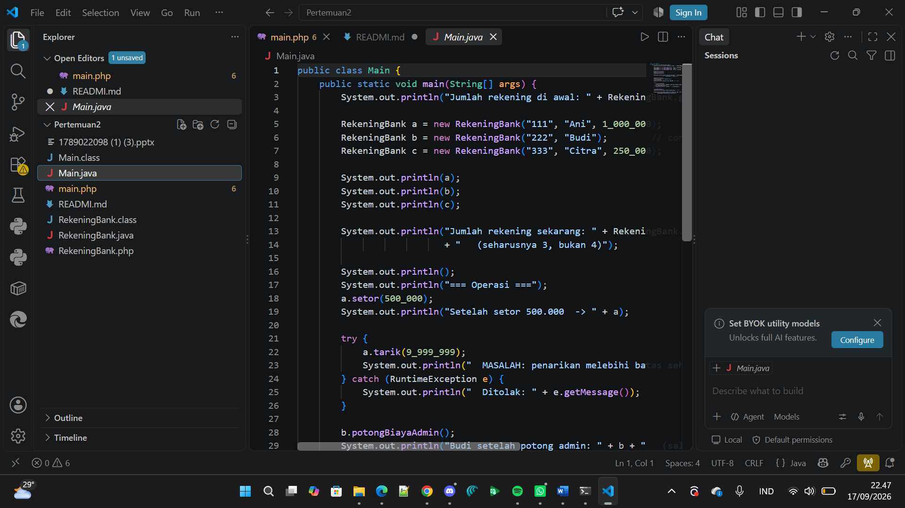
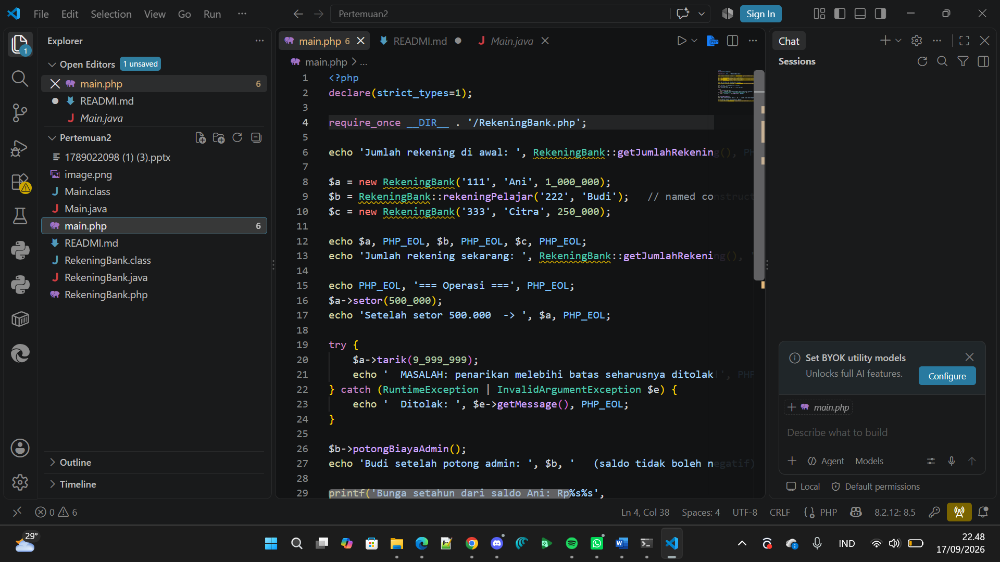
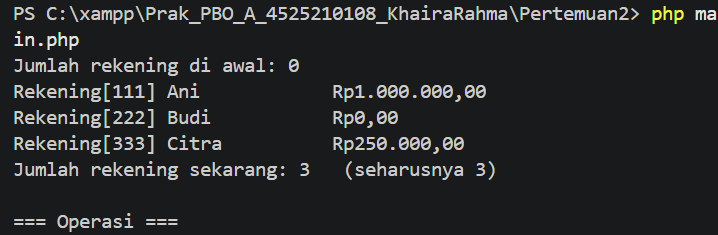
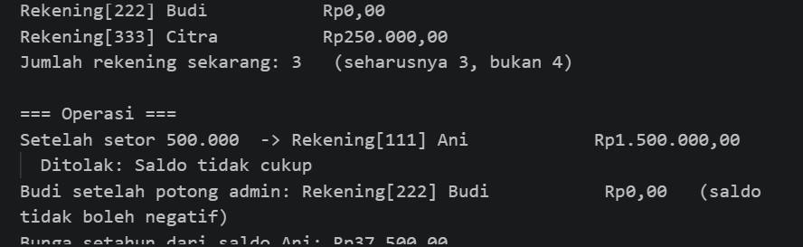

# Sesi 3 — RekeningBank (Java & PHP)

Implementasi class `RekeningBank` dalam dua bahasa (Java & PHP) sebagai latihan
constructor delegation, constructor overloading (dan padanannya di PHP),
anggota statis, serta konstanta.

## Invariant

1. Saldo tidak pernah negatif
2. Nomor rekening tidak berubah setelah objek dibuat
3. Setoran dan penarikan selalu bernilai positif

## Struktur Berkas

| Berkas              | Keterangan                                      |
|---------------------|--------------------------------------------------|
| `RekeningBank.java` | Class utama versi Java                          |
| `Main.java`         | Program uji coba versi Java                     |
| `RekeningBank.php`  | Class utama versi PHP                           |
| `main.php`          | Program uji coba versi PHP                      |

## Konsep yang Dipelajari

### Java
- **Constructor delegation** — constructor ringkas memanggil constructor
  lengkap lewat `this(...)`, jadi validasi cuma ada di satu tempat.
- **Anggota statis** — `private static int jumlahRekening` untuk menghitung
  jumlah objek yang pernah dibuat.
- **Konstanta** — `public static final` untuk nilai yang tidak berubah
  (bunga tahunan, biaya admin, batas penarikan).

### PHP
- PHP tidak punya constructor overloading, jadi dipakai:
  - **Default parameter** pada constructor (`float $saldoAwal = 0`)
  - **Named constructor** (static factory method) seperti
    `RekeningBank::rekeningPelajar(...)`, menggunakan `new static()` agar
    mendukung *late static binding* (bukan `new self()`).

## Cara Menjalankan

### Java
```bash
javac Main.java RekeningBank.java
java Main
```

### PHP
```bash
php main.php
```

## Output Contoh

```
Jumlah rekening di awal: 0
Rekening[111] Ani        Rp1.000.000,00
Rekening[222] Budi       Rp0,00
Rekening[333] Citra      Rp250.000,00
Jumlah rekening sekarang: 3

=== Operasi ===
Setelah setor 500.000  -> Rekening[111] Ani   Rp1.500.000,00
Ditolak: Saldo tidak cukup
Budi setelah potong admin: Rekening[222] Budi  Rp0,00  (saldo tidak boleh negatif)
```



