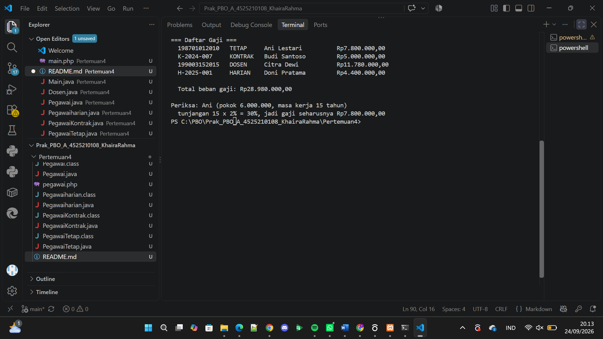
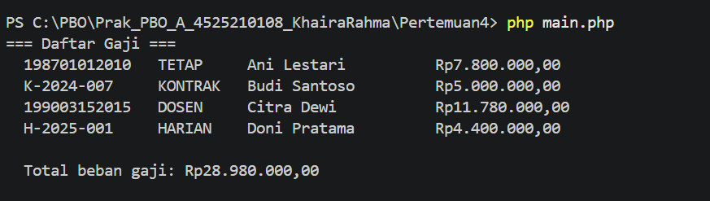

# Hierarki Pegawai — Java & PHP

Implementasi konsep **inheritance (pewarisan)** dan **polymorphism** dalam dua bahasa: Java dan PHP. Program ini menghitung gaji beberapa jenis pegawai yang punya aturan hitung berbeda-beda, tapi dipanggil lewat satu method yang sama: `hitungGaji()`.

## Struktur Kelas

```
Pegawai (abstract)
├── PegawaiTetap
│   └── Dosen
├── PegawaiKontrak
└── PegawaiHarian
```

### `Pegawai` (kelas induk / abstract)
Menyimpan atribut yang sama di semua jenis pegawai: `nip`, `nama`, `gajiPokok`.

- `hitungGaji()` — default mengembalikan `gajiPokok` apa adanya. Di-override oleh turunan yang butuh rumus berbeda.
- `jenis()` — abstract, wajib diimplementasikan tiap turunan untuk menyebutkan jenis pegawainya (`"TETAP"`, `"KONTRAK"`, dst).
- Validasi: gaji pokok tidak boleh negatif (dilempar exception).

### `PegawaiTetap extends Pegawai`
Pegawai tetap mendapat **tunjangan masa kerja**: 2% dari gaji pokok per tahun kerja, maksimum 40%.

```
gaji = gajiPokok + (gajiPokok × min(masaKerja × 2%, 40%))
```

### `PegawaiKontrak extends Pegawai`
Tidak mendapat tunjangan apa pun → tidak perlu override `hitungGaji()`, cukup pakai bawaan dari `Pegawai` (gaji = gaji pokok).

### `Dosen extends PegawaiTetap`
Dosen adalah pegawai tetap **plus** tunjangan fungsional (nominal tetap per bulan/periode, tidak bergantung SKS pada versi Java, dan sesuai parameter langsung pada versi PHP).

```
gaji = (gaji PegawaiTetap) + tunjanganFungsional
```

### `PegawaiHarian` / `Pegawaiharian` extends Pegawai
Gaji dihitung dari upah harian dikali jumlah hari kerja.

```
gaji = upahPerHari × hariKerja
```

> **Catatan penamaan:** Di Java kelas ini ditulis `Pegawaiharian` (huruf kecil pada "harian"), sedangkan di PHP ditulis `PegawaiHarian` (PascalCase penuh). Keduanya konsisten dengan pemanggilannya masing-masing di `Main.java` dan `main.php`, tapi kalau mau menyamakan konvensi penamaan di kemudian hari, sebaiknya disesuaikan ke PascalCase penuh di Java juga.

## Cara Menjalankan

### Java
```bash
javac Pegawai.java PegawaiTetap.java PegawaiKontrak.java Dosen.java Pegawaiharian.java Main.java
java Main
```

### PHP
```bash
php main.php
```

## Contoh Output

```
=== Daftar Gaji ===
  198701012010   TETAP     Ani Lestari          Rp7.800.000,00
  K-2024-007     KONTRAK   Budi Santoso         Rp5.000.000,00
  199003152015   DOSEN     Citra Dewi           Rp11.780.000,00
  H-2025-001     HARIAN    Doni Pratama         Rp4.400.000,00

  Total beban gaji: Rp28.980.000,00
```

### Rincian Perhitungan

| Nama   | Jenis   | Rumus                                              | Hasil          |
|--------|---------|-----------------------------------------------------|----------------|
| Ani    | Tetap   | 6.000.000 + (15×2%=30% × 6.000.000)                | Rp7.800.000    |
| Budi   | Kontrak | 5.000.000 (tanpa tunjangan)                        | Rp5.000.000    |
| Citra  | Dosen   | 8.000.000 + (8×2%=16% × 8.000.000) + 2.500.000     | Rp11.780.000   |
| Doni   | Harian  | 200.000 × 22 hari                                  | Rp4.400.000    |

## Konsep yang Dipelajari

- **Abstract class & abstract method** — `Pegawai` tidak bisa di-*instantiate* langsung, dan setiap turunan wajib mengimplementasikan `jenis()`.
- **Inheritance berjenjang** — `Dosen` bukan turunan langsung dari `Pegawai`, melainkan dari `PegawaiTetap`, sehingga otomatis mendapat logika tunjangan masa kerja tanpa menulis ulang.
- **Method overriding** — `hitungGaji()` ditimpa di beberapa turunan, tapi tetap memanggil `super()` / `parent::` supaya tidak menduplikasi rumus induk.
- **Polymorphism** — di `Main`, satu array/loop `Pegawai[]` bisa memuat objek dari kelas berbeda-beda, dan `hitungGaji()` yang dipanggil otomatis sesuai jenis objeknya masing-masing.
- **Validasi input** — constructor menolak nilai gaji pokok atau hari kerja/masa kerja yang negatif.

# Hasil Output 
 java
 php