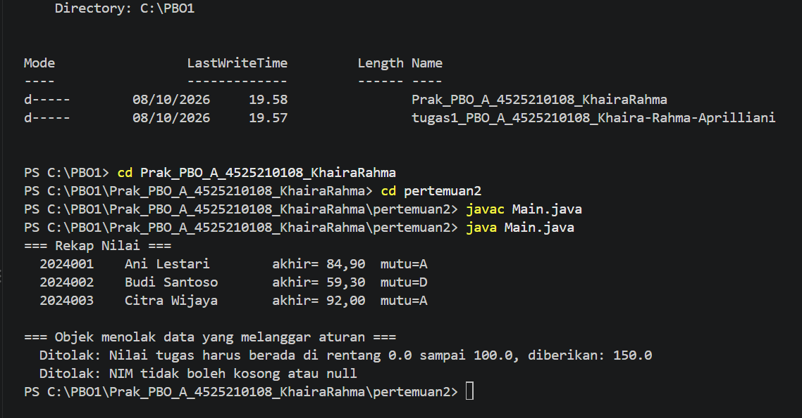
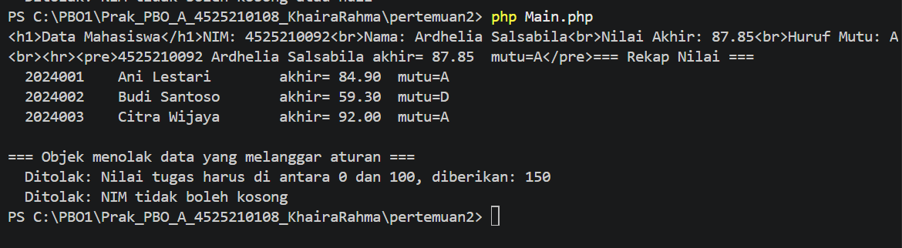

# LAPORAN PRAKTIKUM PEMROGRAMAN BERBASIS OBJEK

| Informasi Praktikan | Keterangan |
|---|---|
| **Nama** | Khaira Rahma Aprilliani|
| **NPM** | 4525210108 |
| **Kelas** | A |
| **Mata Kuliah** | Pemrograman Berbasis Objek (PBO) |
| **Pertemuan** | [02] - [Enkapsulsasi] |
| **Tanggal** | [10-09-2026] |

## 1. Implemntasi Java

### 1.1 File Mahasiswa.java

### Sebelum

Kode awal `Mahasiswa.java` berisi kerangka class dengan beberapa komentar `TODO` yang harus dikerjakan.

.png)

.png)

.png)

**Yang diminta (TODO):**

1. **TODO 1**: `nim` dan `nama` tidak boleh berubah setelah objek dibuat, jadi dibuat `final`. Nilai (tugas, UTS, UAS) boleh berubah, jadi tidak `final`.
2. **TODO 2**: Constructor harus menolak NIM yang kosong atau `null`.
3. **TODO 3**: Constructor harus menolak setiap komponen nilai yang di luar rentang 0-100.
4. **TODO 4**: Buat method `private` pembantu (`pastikanNilaiSah`) untuk memvalidasi satu komponen nilai.
5. **TODO 5**: Hitung nilai akhir memakai konstanta bobot (30% tugas + 30% UTS + 40% UAS), bukan angka yang ditulis langsung.
6. **TODO 6**: Kembalikan huruf mutu berdasarkan nilai akhir (A = 80 ke atas, B = 70-79, C = 60-69, D = 50-59, E = di bawah 50).
7. **TODO 7**: Buat getter untuk `nim`, `nama`, dan `nilaiAkhir`. Tidak boleh ada `setNim()`.

**Kondisi kode sebelum diperbaiki:**

- Validasi NIM hanya memeriksa `nim == null || nim.isBlank()`, dan NIM disimpan apa adanya (tanpa spasi di pinggir dibuang).
- `pastikanNilaiSah` hanya memeriksa `nilai < NILAI_MIN || nilai > NILAI_MAX`. Nilai `NaN` (bukan angka) atau `Infinity` belum ditangani.
- `hurufMutu()` langsung membandingkan nilai akhir tanpa memeriksa apakah nilainya valid.

### Setelah

Kode setelah diperbaiki: validasi dibuat lebih ketat dan lebih aman.

.png)

.png)

.png)

.png)

**Penjelasan perubahan:**

1. **Validasi NIM lebih ketat.** Kondisi diganti menjadi `nim == null || nim.trim().isEmpty()`, dan pesan error menjadi `"NIM tidak boleh kosong atau null"`. NIM yang lolos disimpan dalam variabel `nimValid = nim.trim()`, sehingga spasi di awal/akhir otomatis dibuang (`" 2024001 "` disimpan sebagai `"2024001"`).
2. **Validasi nilai lebih lengkap.** `pastikanNilaiSah` sekarang juga menolak nilai `NaN` dan `Infinity` lewat `Double.isNaN(nilai)` dan `Double.isInfinite(nilai)`, selain nilai di luar rentang 0-100.
3. **Nama komponen ikut divalidasi.** Method pembantu juga memeriksa bahwa `namaKomponen` tidak null atau kosong, sehingga pesan error selalu jelas menyebut komponen mana yang salah.
4. **Pesan error lebih jelas.** Bunyinya menjadi `"Nilai tugas harus berada di rentang 0.0 sampai 100.0, diberikan: 150.0"`, jadi pengguna tahu batas yang benar dan nilai yang salah.
5. **Validasi dulu, baru simpan.** Semua pengecekan (NIM dan ketiga nilai) dijalankan lebih dulu, baru setelah semuanya lolos nilai-nilai diisikan ke properti (`this.nim = nimValid;`, dst.). Dengan begitu objek tidak pernah terbentuk dalam kondisi setengah jadi.
6. **`nilaiAkhir()` lebih rapi.** Rumusnya sama, tetapi setiap suku diberi tanda kurung dan ditulis per baris supaya mudah dibaca:
   `(nilaiTugas * BOBOT_TUGAS) + (nilaiUts * BOBOT_UTS) + (nilaiUas * BOBOT_UAS)`.
7. **`hurufMutu()` diberi pengaman.** Sebelum menentukan huruf, nilai akhir diperiksa. Kalau `NaN` atau `Infinity`, method melempar `IllegalStateException("Nilai akhir tidak valid")`.
8. **Getter tetap tanpa setter NIM.** `getNim()`, `getNama()`, dan `getNilaiAkhir()` tetap ada, dan `nim` serta `nama` tetap `final`, sehingga tidak bisa diubah setelah objek dibuat.

## Output java

## Output php

Program PBO yang menunjukkan bagaimana **enkapsulasi** dipakai untuk menjaga aturan (*invariant*) sebuah objek. Objek `Mahasiswa` menolak data yang tidak sah sejak constructor dipanggil, sehingga tidak mungkin ada objek dengan data rusak.

## Invariant

1. `nim` tidak boleh kosong/null dan **tidak berubah** setelah objek dibuat
2. Setiap komponen nilai (tugas, UTS, UAS) harus berada di rentang **0 - 100**
3. Nilai akhir = **30% tugas + 30% UTS + 40% UAS**

## Kesimpulan: 

Dengan enkapsulasi (properti `private`, `nim` dan `nama` `final`, serta validasi di constructor), objek `Mahasiswa` tidak mungkin dibuat dengan data yang melanggar aturan. Perbaikan pada kode (membuang spasi NIM, menolak `NaN` dan `Infinity`, serta pengaman di `hurufMutu()`) membuat objek lebih tahan terhadap input yang tidak wajar, dan semua aturan (invariant) tetap terjaga sepanjang objek hidup.
