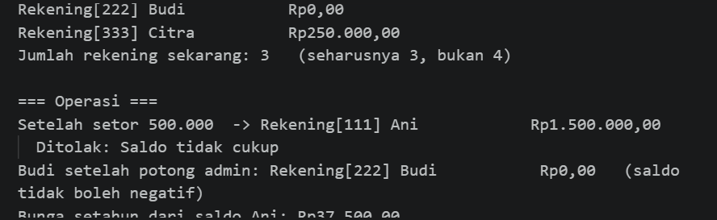
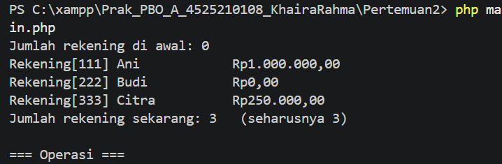
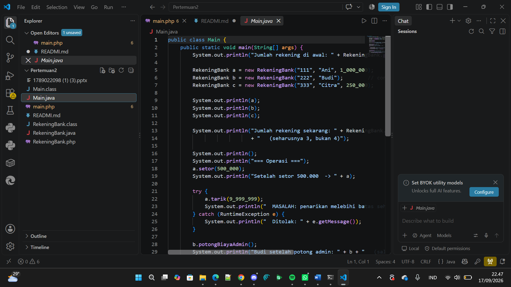
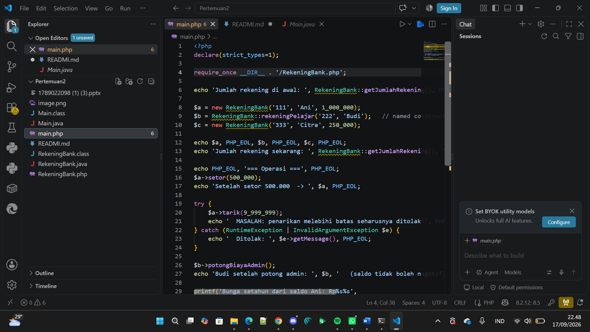

# LAPORAN PRAKTIKUM PEMROGRAMAN BERBASIS OBJEK

| Informasi Praktikan | Keterangan |
|---|---|
| **Nama** | Khaira Rahma Aprilliani|
| **NPM** | 4525210108 |
| **Kelas** | A |
| **Mata Kuliah** | Pemrograman Berbasis Objek (PBO) |
| **Pertemuan** | [03] - [Constructor Berdelegasi, Anggota Statis, dan Konstanta] |
| **Tanggal** | [17-09-2026] |

## 1. Implementasi Java

### 1.1 File RekeningBank.java

### Sebelum

Kode awal berisi kerangka class dengan 10 komentar `TODO` yang harus dikerjakan.

.png)

.png)

.png)

**Yang diminta (TODO):**

1. **TODO 1**: Ganti tiga angka ajaib menjadi konstanta (`public static final`), tidak boleh ada angka literal di dalam badan method:
   - bunga tahunan: `0.025`
   - biaya administrasi: `5000`
   - batas penarikan sekali: `5000000`
2. **TODO 2**: Deklarasikan field statis penghitung jumlah rekening (`static`, `private`, nilai awal `0`).
3. **TODO 3**: Constructor ringkas (`nomor`, `pemilik`) harus **mendelegasikan** ke constructor lengkap dengan `this(...)`, tidak menyalin validasi.
4. **TODO 4**: Constructor lengkap adalah **satu-satunya** tempat validasi: tolak nomor kosong dan saldo awal negatif.
5. **TODO 5**: Naikkan penghitung jumlah rekening **di constructor lengkap saja**, bukan di kedua constructor.
6. **TODO 6**: Method `setor()`: tolak jumlah `<= 0`, lalu tambahkan ke saldo.
7. **TODO 7**: Method `tarik()`: tolak jumlah `<= 0`, tolak jika melebihi saldo, dan tolak jika melebihi batas penarikan sekali transaksi.
8. **TODO 8**: Method `potongBiayaAdmin()`: kurangi saldo sebesar biaya administrasi, tetapi jangan sampai negatif.
9. **TODO 9**: Method statis `getJumlahRekening()`: kembalikan jumlah rekening yang pernah dibuat.
10. **TODO 10**: Method statis `bungaSetahun(pokok)`: hitung bunga setahun dari pokok. Method ini tidak membaca objek mana pun, itulah alasan ia pantas menjadi `static`.

**Kondisi kode sebelum dikerjakan:**

- Constructor ringkas masih menyalin sendiri `this.nomor`, `this.pemilik`, dan `this.saldo = 0` (belum delegasi).
- Constructor lengkap belum punya validasi sama sekali.
- `setor()`, `tarik()`, dan `potongBiayaAdmin()` masih kosong.
- `getJumlahRekening()` masih `return -1` dan `bungaSetahun()` masih `return 0` (nilai sementara).

### Setelah

.png)

.png)

.png)

.png)

**Penjelasan kode:**

1. **Konstanta (TODO 1).** Tiga angka ajaib sudah diganti menjadi `BUNGA_TAHUNAN = 0.025`, `BIAYA_ADMINISTRASI = 5000`, dan `BATAS_PENARIKAN_SEKALI = 5000000`, semuanya `public static final double`. Kalau nilainya perlu diubah, cukup ubah di satu tempat.
2. **Penghitung statis (TODO 2).** `private static int jumlahRekening = 0;` adalah milik **class**, bukan milik objek, sehingga nilainya dipakai bersama oleh semua objek `RekeningBank`.
3. **Delegasi constructor (TODO 3).** Constructor ringkas kini hanya berisi `this(nomor, pemilik, 0);`. Ia meneruskan pekerjaan ke constructor lengkap dengan saldo awal 0, sehingga tidak ada kode yang diulang.
4. **Validasi di satu tempat (TODO 4).** Constructor lengkap menolak `nomor == null || nomor.isBlank()` dengan pesan `"Nomor rekening tidak boleh kosong"`, dan menolak `saldoAwal < 0` dengan pesan `"Saldo awal tidak boleh negatif"`. Karena constructor ringkas mendelegasikan ke sini, objek yang dibuat lewat constructor mana pun tetap tervalidasi.
5. **Penghitung naik sekali saja (TODO 5).** `jumlahRekening++;` ada di constructor lengkap, setelah validasi lolos. Kalau dinaikkan di kedua constructor, satu objek yang dibuat lewat constructor ringkas akan terhitung dua kali, karena constructor ringkas memanggil constructor lengkap.
6. **`setor()` (TODO 6).** Jumlah `<= 0` ditolak dengan `"Jumlah setor harus positif"`, selebihnya ditambahkan ke saldo.
7. **`tarik()` (TODO 7).** Ada tiga penolakan, berurutan: jumlah `<= 0` (`"Jumlah tarik harus positif"`), jumlah `> saldo` (`"Saldo tidak cukup"`), dan jumlah `> BATAS_PENARIKAN_SEKALI` (`"Melebihi batas penarikan sekali transaksi"`). Kalau lolos semua, `saldo -= jumlah;`.
8. **`potongBiayaAdmin()` (TODO 8).** `saldo = Math.max(0, saldo - BIAYA_ADMINISTRASI);` memastikan saldo paling kecil 0, tidak pernah negatif.
9. **`getJumlahRekening()` (TODO 9).** Method statis yang mengembalikan `jumlahRekening`, sehingga bisa dipanggil lewat nama class: `RekeningBank.getJumlahRekening()`.
10. **`bungaSetahun()` (TODO 10).** `return pokok * BUNGA_TAHUNAN;`. Method ini hanya memakai parameter dan konstanta, tidak menyentuh data objek, jadi cocok dibuat `static`.

### Output java

## 2. Implementasi php

### 2.1 File RekeningBank.php

### Sebelum

Kerangka yang sama dalam PHP. Karena PHP tidak punya *constructor overloading*, constructor ringkas digantikan **parameter default** dan **named constructor** (static factory).

.png)

.png)

.png)

.png)

**Yang diminta (TODO):**

1. **TODO 1**: Ganti angka ajaib menjadi konstanta bernama (bunga tahunan `0.025`, biaya admin `5000`, batas penarikan `5000000`).
2. **TODO 2**: Deklarasikan properti statis penghitung jumlah rekening.
3. **TODO 3**: Lengkapi validasi nomor kosong dan saldo awal negatif di constructor.
4. **TODO 4**: Naikkan penghitung jumlah rekening.
5. **TODO 5**: Buat *named constructor* `rekeningPelajar()` (rekening pelajar dengan saldo awal nol). Wajib memakai `new static()`, **bukan** `new self()`. Alasannya ada pada materi *late static binding*.
6. **TODO 6**: `setor()`: tolak jumlah `<= 0`, lalu tambahkan ke saldo.
7. **TODO 7**: `tarik()`: tolak `<= 0`, tolak melebihi saldo, tolak melebihi batas sekali tarik.
8. **TODO 8**: `potongBiayaAdmin()`: kurangi saldo sebesar biaya admin, saldo tidak boleh negatif.
9. **TODO 9**: `getJumlahRekening()`: kembalikan jumlah rekening.
10. **TODO 10**: `bungaSetahun()`: hitung bunga setahun dari pokok.

**Kondisi kode sebelum dikerjakan:**

- Constructor memakai *constructor promotion* (`private readonly string $nomor`, `$pemilik`, dan `float $saldoAwal = 0`), tetapi isinya baru `$this->saldo = $saldoAwal;` tanpa validasi.
- `rekeningPelajar()` masih melempar `RuntimeException('TODO 5 belum dikerjakan')`.
- `setor()`, `tarik()`, dan `potongBiayaAdmin()` masih kosong.
- `getJumlahRekening()` masih `return -1` dan `bungaSetahun()` masih `return 0`.

### Setelah

.png)

.png)

.png)

.png)

.png)

**Penjelasan kode:**

1. **Konstanta (TODO 1).** `public const BUNGA_TAHUNAN = 0.025;`, `BIAYA_ADMINISTRASI = 5000;`, dan `BATAS_PENARIKAN_SEKALI = 5000000;`. Dipakai di dalam class dengan `self::NAMA_KONSTANTA`.
2. **Properti statis (TODO 2).** `private static int $jumlahRekening = 0;` dipakai bersama oleh semua objek, dan diakses lewat `self::$jumlahRekening`.
3. **Pengganti constructor overloading.** Parameter `float $saldoAwal = 0` membuat `new RekeningBank("001", "Budi")` dan `new RekeningBank("001", "Budi", 100000)` sama-sama bisa dipakai dengan satu constructor. Inilah pengganti constructor ringkas milik Java.
4. **Validasi (TODO 3).** Constructor menolak `trim($this->nomor) === ''` dengan pesan `'Nomor rekening tidak boleh kosong'`, dan `$saldoAwal < 0` dengan pesan `'Saldo awal tidak boleh negatif'`, memakai `InvalidArgumentException`. Properti `readonly` membuat `nomor` dan `pemilik` tidak bisa diubah setelah objek dibuat.
5. **Penghitung naik (TODO 4).** `self::$jumlahRekening++;` dijalankan setelah semua validasi lolos, jadi objek yang gagal dibuat tidak ikut terhitung.
6. **Named constructor (TODO 5).** `rekeningPelajar()` mengembalikan `new static($nomor, $pemilik, 0);`. Memakai `static` (bukan `self`) berarti objek yang dibuat mengikuti class yang **memanggil** method ini (*late static binding*). Kalau ada class turunan `RekeningBank`, hasilnya objek class turunan itu, bukan `RekeningBank` biasa.
7. **`setor()` (TODO 6).** Jumlah `<= 0` ditolak dengan `'Jumlah setor harus positif'`, selebihnya `$this->saldo += $jumlah;`.
8. **`tarik()` (TODO 7).** Tiga penolakan berurutan: `<= 0` (`'Jumlah tarik harus positif'`), `> $this->saldo` (`'Saldo tidak cukup'`), dan `> self::BATAS_PENARIKAN_SEKALI` (`'Melebihi batas penarikan sekali transaksi'`). Lolos semua, `$this->saldo -= $jumlah;`.
9. **`potongBiayaAdmin()` (TODO 8).** `$this->saldo = max(0, $this->saldo - self::BIAYA_ADMINISTRASI);` memastikan saldo tidak turun di bawah 0.
10. **`getJumlahRekening()` (TODO 9).** `return self::$jumlahRekening;` sebagai method statis, dipanggil dengan `RekeningBank::getJumlahRekening()`.
11. **`bungaSetahun()` (TODO 10).** `return $pokok * self::BUNGA_TAHUNAN;` sebagai method statis karena tidak memakai data objek.
12. **`__toString()`.** Format teks `Rekening[nomor] pemilik Rp...` memakai `sprintf` dan `number_format($this->saldo, 2, ',', '.')` agar saldo tampil dengan pemisah ribuan titik dan desimal koma.

### Output php

## Kesimpulan:

1. **Konstanta bernama** menggantikan angka ajaib sehingga aturan bisnis (bunga, biaya admin, batas tarik) ada di satu tempat dan mudah diubah.
2. **Constructor berdelegasi** (`this(...)` di Java, parameter default di PHP) membuat validasi hanya ditulis sekali di constructor lengkap, tetapi tetap berlaku untuk semua cara membuat objek. Penghitung rekening juga hanya dinaikkan di satu tempat sehingga tidak terhitung ganda.
3. **Anggota statis** (`jumlahRekening`, `getJumlahRekening()`, `bungaSetahun()`) adalah milik class, bukan milik objek. Cocok untuk data bersama dan fungsi yang tidak butuh data objek.
4. **Late static binding** (`new static()` di PHP) membuat *named constructor* ikut menghasilkan objek dari class yang memanggilnya, bukan selalu class induk.
5. Dengan semua perubahan di atas, tiga invariant tetap terjaga: saldo tidak pernah negatif, nomor rekening tidak bisa diubah (`final` / `readonly`), dan setoran serta penarikan selalu positif.