# Pertemuan 4 - Pewarisan (Inheritance)

Implementasi konsep **inheritance (pewarisan)** dan **polymorphism** dalam dua bahasa: Java dan PHP. Program ini menghitung gaji beberapa jenis pegawai yang punya aturan hitung berbeda-beda, tapi dipanggil lewat satu method yang sama: `hitungGaji()`.

## File Pegawai.java

### Sebelum

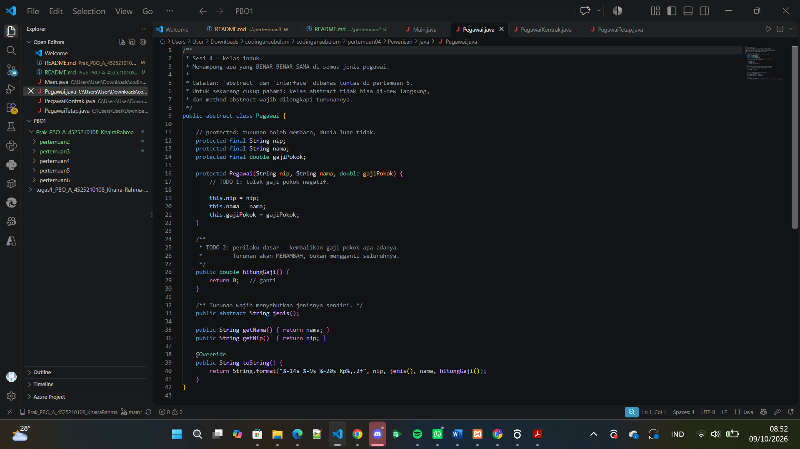

**Yang diminta:**

- `Pegawai` adalah **kelas induk** yang menampung apa yang benar-benar sama di semua jenis pegawai. Kelasnya `abstract`, jadi tidak bisa di-`new` langsung, dan method `abstract` wajib dilengkapi oleh turunannya.
- **TODO 1**: constructor harus menolak gaji pokok negatif.
- **TODO 2**: perilaku dasar `hitungGaji()` harus mengembalikan gaji pokok apa adanya. Turunan nanti **menambah**, bukan mengganti seluruhnya.

**Kondisi kode awal:**

- Properti `nip`, `nama`, `gajiPokok` bertipe `protected final` (turunan boleh membaca, dunia luar tidak).
- Constructor belum punya validasi.
- `hitungGaji()` masih `return 0;` sebagai nilai sementara.
- `jenis()` sudah `abstract`, serta ada `getNama()`, `getNip()`, dan `toString()`.

### Setelah

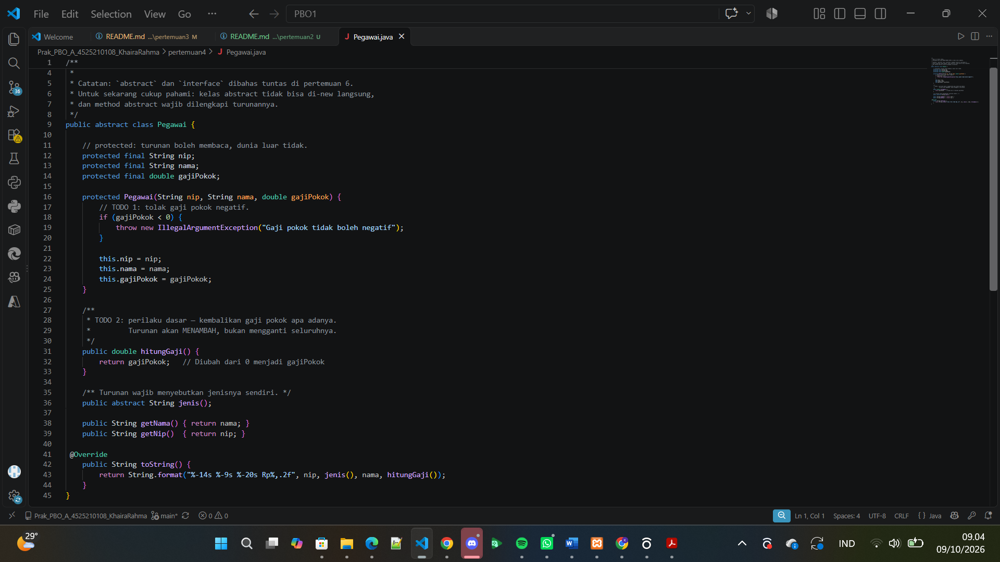

**Penjelasan kode:**

1. **Validasi (TODO 1).** `if (gajiPokok < 0)` melempar `IllegalArgumentException("Gaji pokok tidak boleh negatif")`. Validasi ditaruh di kelas induk sehingga berlaku untuk **semua** jenis pegawai.
2. **Perilaku dasar (TODO 2).** `hitungGaji()` sekarang `return gajiPokok;` (sebelumnya `return 0;`). Turunan yang butuh tunjangan cukup memanggil `super.hitungGaji()` lalu menambahkan sendiri.
3. **`jenis()` tetap `abstract`.** Setiap turunan wajib menyebutkan jenisnya sendiri (`TETAP`, `KONTRAK`, dan seterusnya).
4. **`toString()`** memakai `String.format("%-14s %-9s %-20s Rp%,.2f", ...)` agar tiap baris rapi berbentuk tabel.

## File PegawaiTetap.java

### Sebelum

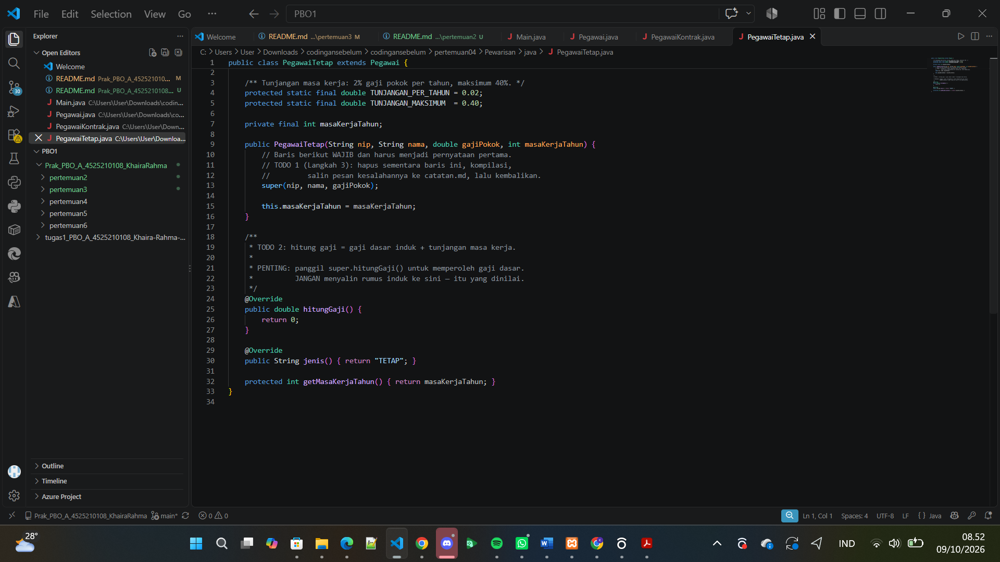

**Yang diminta:**

- **TODO 1 (Langkah 3)**: baris `super(nip, nama, gajiPokok);` wajib menjadi pernyataan pertama di constructor. Untuk membuktikannya, hapus baris itu sementara, kompilasi, salin pesan kesalahannya ke `catatan.md`, lalu kembalikan.
- **TODO 2**: hitung gaji = gaji dasar induk + tunjangan masa kerja. **Panggil `super.hitungGaji()`** untuk gaji dasar, **jangan menyalin rumus induk** ke sini.

**Kondisi kode awal:**

- Konstanta `TUNJANGAN_PER_TAHUN = 0.02` (2%) dan `TUNJANGAN_MAKSIMUM = 0.40` (40%) sudah ada.
- Properti `masaKerjaTahun` dan constructor sudah ada.
- `hitungGaji()` masih `return 0;`.

**Hasil percobaan Langkah 3** (baris `super(...)` dihapus lalu dikompilasi):

PegawaiTetap.java:7: error: constructor Pegawai in class Pegawai cannot be applied to given types;
  required: String,String,double
  found:    no arguments
  reason: actual and formal argument lists differ in length

Penyebabnya: `Pegawai` hanya punya constructor yang meminta tiga parameter. Kalau `super(...)` tidak ditulis, Java otomatis memanggil `super()` tanpa parameter, yang tidak ada di `Pegawai`.

### Setelah

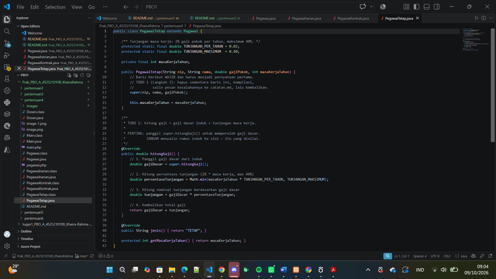

**Penjelasan kode:**

1. **Constructor.** `super(nip, nama, gajiPokok);` dikembalikan sebagai pernyataan pertama, lalu `this.masaKerjaTahun = masaKerjaTahun;`.
2. **`hitungGaji()` dalam 4 langkah:**
   - `double gajiDasar = super.hitungGaji();` mengambil gaji dasar dari induk (tidak menyalin rumus).
   - `double persentaseTunjangan = Math.min(masaKerjaTahun * TUNJANGAN_PER_TAHUN, TUNJANGAN_MAKSIMUM);` menghitung 2% per tahun, tetapi dibatasi maksimum 40%.
   - `double tunjangan = gajiDasar * persentaseTunjangan;` menghitung nominal tunjangan.
   - `return gajiDasar + tunjangan;` mengembalikan total gaji.
3. **Contoh.** Ani: pokok 6.000.000, masa kerja 15 tahun, maka 15 x 2% = 30%, tunjangan 1.800.000, gaji 7.800.000.
4. **`jenis()`** mengembalikan `"TETAP"`, dan `getMasaKerjaTahun()` bersifat `protected`.

## File PegawaiKontrak.java

### Sebelum

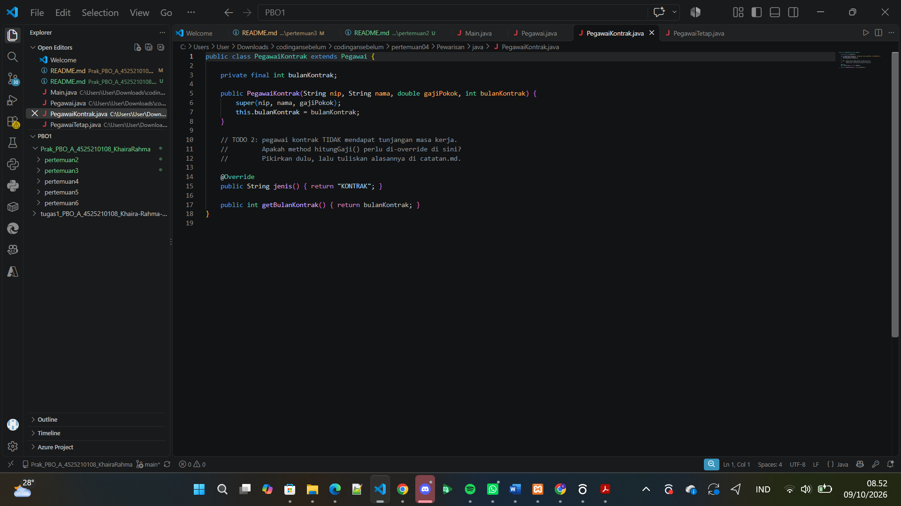

**Yang diminta:**

- **TODO 2**: pegawai kontrak **tidak** mendapat tunjangan masa kerja. Pertanyaannya: apakah `hitungGaji()` perlu di-override di sini? Dipikirkan dulu, lalu alasannya ditulis di `catatan.md`.

**Kondisi kode awal:** sudah ada properti `bulanKontrak`, constructor yang memanggil `super(...)`, `jenis()` yang mengembalikan `"KONTRAK"`, dan `getBulanKontrak()`.

### Setelah

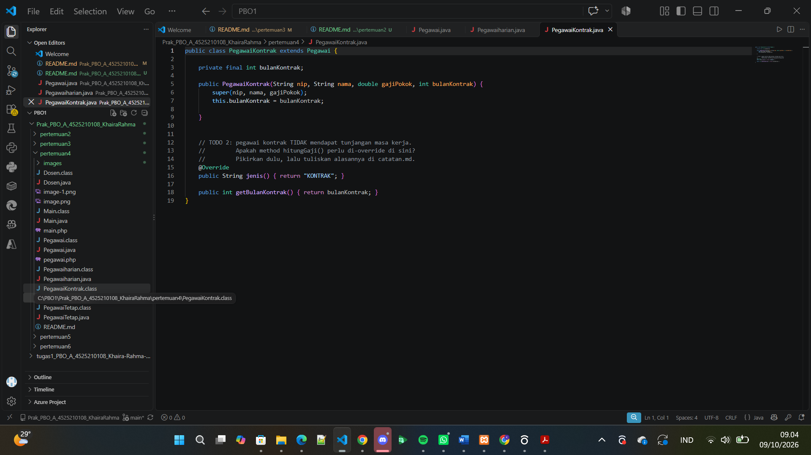

**Penjelasan:**

1. **Tidak perlu di-override.** Setelah `Pegawai.hitungGaji()` diubah menjadi `return gajiPokok;`, perilaku itu sudah tepat untuk pegawai kontrak: gaji pokok tanpa tunjangan. Kalau di-override hanya untuk mengembalikan nilai yang sama, itu kode berulang tanpa manfaat.
2. **Warisan bekerja otomatis.** Saat `PegawaiKontrak` memanggil `hitungGaji()`, yang berjalan adalah versi milik `Pegawai`.
3. Jadi kelas ini cukup menambahkan yang khas: `bulanKontrak` dan `jenis()`.

## File Pegawaiharian.java (kelas baru)

### Setelah

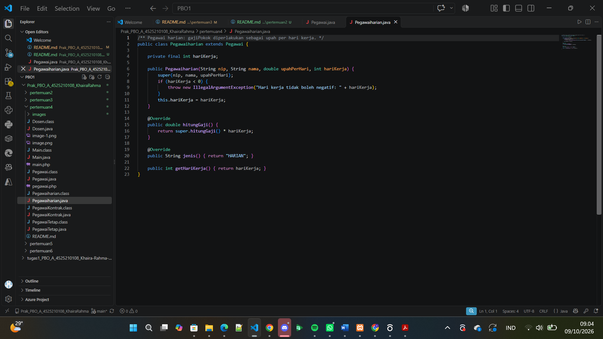

**Penjelasan kode:**

1. **Kelas baru** `Pegawaiharian extends Pegawai`, dibuat untuk pegawai dengan upah per hari kerja. `gajiPokok` di induk diperlakukan sebagai **upah per hari**.
2. **Constructor** `(nip, nama, upahPerHari, hariKerja)` memanggil `super(nip, nama, upahPerHari)`, lalu menolak `hariKerja < 0` dengan `IllegalArgumentException("Hari kerja tidak boleh negatif: " + hariKerja)`.
3. **`hitungGaji()`** mengembalikan `super.hitungGaji() * hariKerja`, yaitu upah per hari dikali jumlah hari kerja.
4. **`jenis()`** mengembalikan `"HARIAN"`, dan ada `getHariKerja()`.

## File Dosen.java (kelas baru)

### Setelah

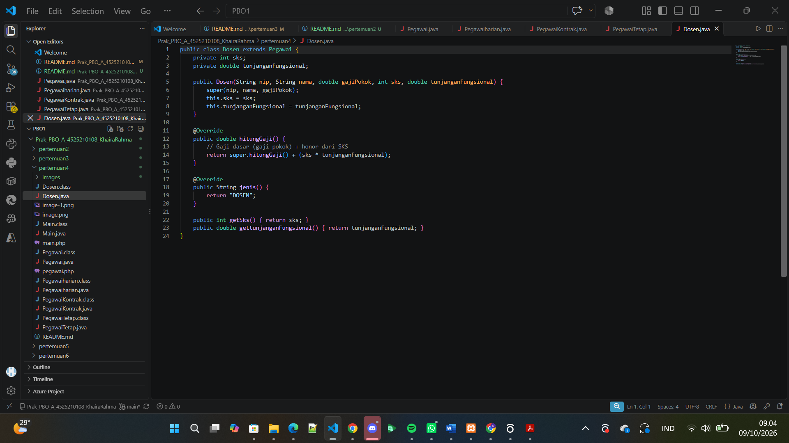

**Penjelasan kode:**

1. **Kelas baru** `Dosen extends Pegawai` dengan dua properti tambahan: `sks` dan `tunjanganFungsional`.
2. **Constructor** `(nip, nama, gajiPokok, sks, tunjanganFungsional)` memanggil `super(nip, nama, gajiPokok)` lalu mengisi dua properti tambahan.
3. **`hitungGaji()`** mengembalikan `super.hitungGaji() + (sks * tunjanganFungsional)`, yaitu gaji pokok ditambah honor dari SKS.
4. **`jenis()`** mengembalikan `"DOSEN"`, serta ada `getSks()` dan `gettunjanganFungsional()`.

## File Main.java

### Sebelum

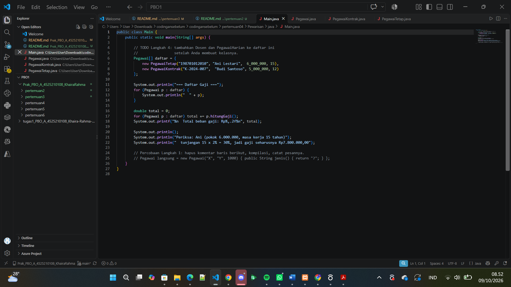

**Yang diminta:**

- **TODO Langkah 4**: tambahkan `Dosen` dan `PegawaiHarian` ke daftar setelah kelasnya dibuat.

**Kondisi kode awal:**

- Array `Pegawai[] daftar` baru berisi `PegawaiTetap` (Ani Lestari) dan `PegawaiKontrak` (Budi Santoso).
- Program mencetak daftar gaji lewat `for`, menjumlahkan `hitungGaji()` semua pegawai, lalu mencetak total beban gaji.
- Di bawahnya ada baris pemeriksaan manual: gaji Ani seharusnya **Rp7.800.000,00**.
- Ada percobaan Langkah 1 yang dikomentari: `new Pegawai("X", "Y", 1000)` untuk membuktikan class `abstract` tidak bisa langsung di-`new`.

### Setelah

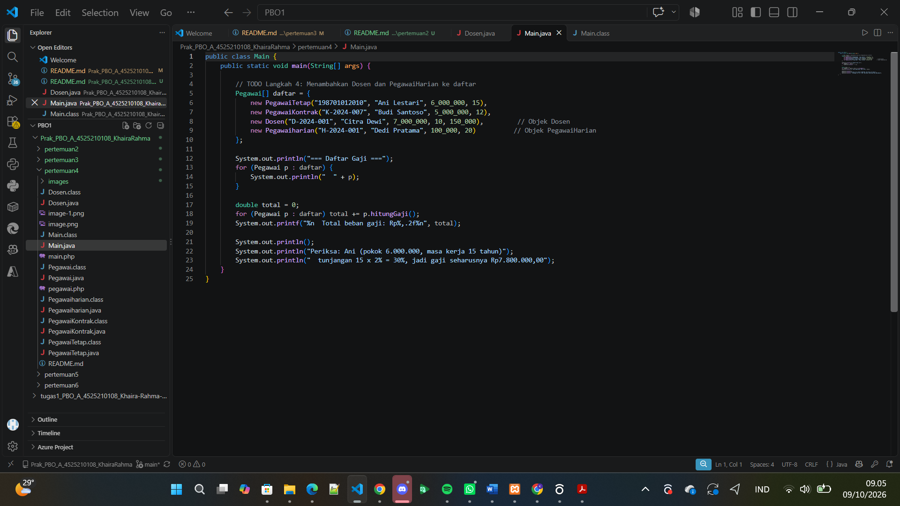

**Penjelasan kode:**

1. **Daftar jadi empat jenis pegawai.** `Dosen` (`D-2024-001`, Citra Dewi, 7.000.000, 10 SKS, tunjangan 150.000) dan `Pegawaiharian` (`H-2024-001`, Dedi Pratama, 100.000/hari, 20 hari) ditambahkan ke array `Pegawai[]`.
2. **Polimorfisme.** Array bertipe `Pegawai`, tetapi isinya objek berbagai turunan. Saat `p.hitungGaji()` dan `toString()` dipanggil, Java otomatis menjalankan versi milik objek yang sebenarnya, tanpa `if` untuk memeriksa jenisnya.
3. **Percobaan Langkah 1.** Mencoba `new Pegawai("X", "Y", 1000)` langsung menghasilkan error `Pegawai is abstract; cannot be instantiated`.

## File pegawai.php (semua class)

Di PHP, seluruh hierarki ditaruh dalam **satu berkas** agar mudah dibaca berdampingan dengan versi Java.

### Sebelum

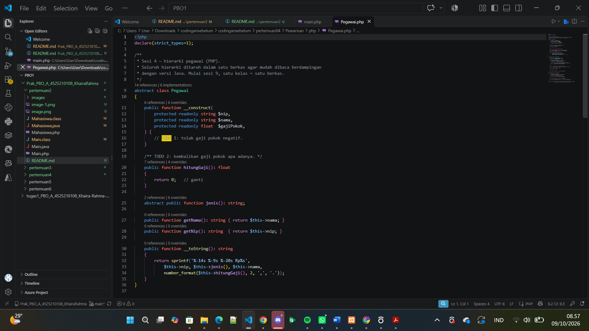

**Yang diminta:**

- **TODO 1**: constructor menolak gaji pokok negatif.
- **TODO 2**: `hitungGaji()` mengembalikan gaji pokok apa adanya.

**Kondisi kode awal:**

- Kelas `abstract class Pegawai` memakai *constructor promotion*: `protected readonly string $nip`, `$nama`, dan `float $gajiPokok`.
- `hitungGaji()` masih `return 0;`.
- `jenis()` berupa `abstract public function`, ditambah `getNama()`, `getNip()`, dan `__toString()` dengan `sprintf` dan `number_format`.

### Setelah

.png)

.png)

.png)

.png)

.png)

**Penjelasan kode:**

1. **`Pegawai` (induk).** `if ($gajiPokok < 0)` melempar `InvalidArgumentException('Gaji pokok tidak boleh negatif.')`, dan `hitungGaji()` mengembalikan `$this->gajiPokok`. Properti `readonly` membuat `nip`, `nama`, dan `gajiPokok` tidak bisa diubah setelah objek dibuat.
2. **`PegawaiTetap`.** Konstanta `TUNJANGAN_PER_TAHUN = 0.02` dan `TUNJANGAN_MAKSIMUM = 0.40` memakai `protected const`. Constructor memanggil `parent::__construct(...)` lebih dulu, lalu menolak `masaKerjaTahun < 0`. `hitungGaji()` memakai `parent::hitungGaji()` untuk gaji dasar, `min(masaKerja * 0.02, 0.40)` untuk persentase, lalu `return $dasar + $dasar * $persen;`.
3. **`PegawaiKontrak`.** Hanya menambah `bulanKontrak`, `jenis()` berisi `'KONTRAK'`, dan **tidak** meng-override `hitungGaji()`.
4. **`Dosen`.** `extends PegawaiTetap`, jadi selain tunjangan masa kerja juga mendapat **tunjangan fungsional** bernominal tetap: `parent::hitungGaji() + $this->tunjanganFungsional`. Constructor menolak tunjangan negatif. *Catatan: ini berbeda dari versi Java, tempat `Dosen` turunan langsung `Pegawai` dan memakai `sks * tunjanganFungsional`.*
5. **`PegawaiHarian`.** Menolak `hariKerja < 0`, dan `hitungGaji()` mengembalikan `parent::hitungGaji() * $this->hariKerja`.
6. **`parent::`** di PHP setara `super.` di Java, baik untuk constructor maupun method.

## File main.php

### Sebelum

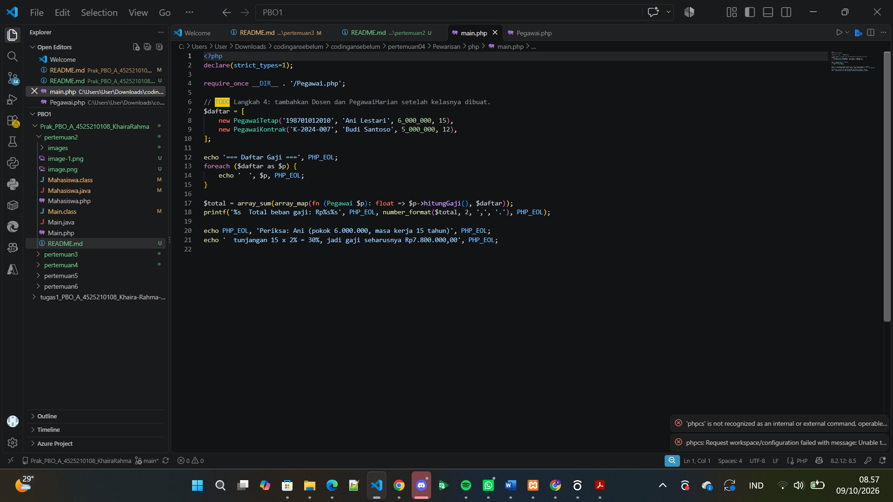

**Yang diminta:**

- **TODO Langkah 4**: tambahkan `Dosen` dan `PegawaiHarian` setelah kelasnya dibuat.

**Kondisi kode awal:** `$daftar` baru berisi `PegawaiTetap` (Ani Lestari) dan `PegawaiKontrak` (Budi Santoso), dengan `require_once` ke `pegawai.php`, `foreach` untuk mencetak daftar, `array_sum(array_map(...))` untuk total, dan baris pemeriksaan manual Rp7.800.000,00.

### Setelah

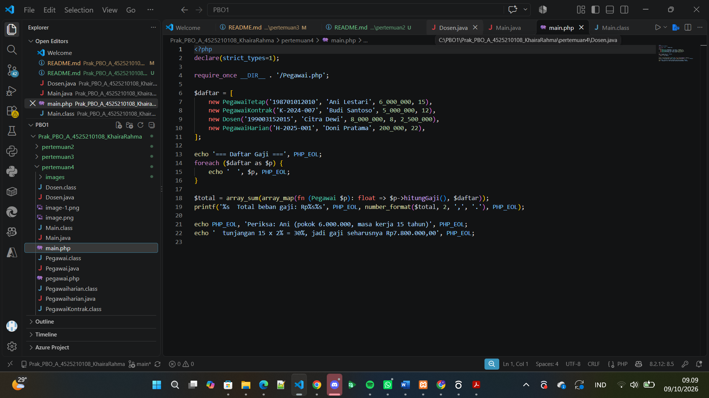

**Penjelasan kode:**

1. **Daftar jadi empat jenis pegawai.** Ditambahkan `Dosen('199003152015', 'Citra Dewi', 8_000_000, 8, 2_500_000)` dan `PegawaiHarian('H-2025-001', 'Doni Pratama', 200_000, 22)`.
2. **`foreach` + `echo $p`** memanggil `__toString()` milik tiap objek, jadi baris tercetak sesuai jenisnya (polimorfisme).
3. **Total gaji** dihitung dengan `array_sum(array_map(fn (Pegawai $p): float => $p->hitungGaji(), $daftar))`, lalu diformat `number_format($total, 2, ',', '.')`.
4. **Percobaan abstract.** `new Pegawai(...)` langsung menghasilkan `Cannot instantiate abstract class Pegawai`.

### `Pegawai` (kelas induk / abstract)
Menyimpan atribut yang sama di semua jenis pegawai: `nip`, `nama`, `gajiPokok`.

- `hitungGaji()` — default mengembalikan `gajiPokok` apa adanya. Di-override oleh turunan yang butuh rumus berbeda.
- `jenis()` — abstract, wajib diimplementasikan tiap turunan untuk menyebutkan jenis pegawainya (`"TETAP"`, `"KONTRAK"`, dst).
- Validasi: gaji pokok tidak boleh negatif (dilempar exception).

### `PegawaiTetap extends Pegawai`
Pegawai tetap mendapat **tunjangan masa kerja**: 2% dari gaji pokok per tahun kerja, maksimum 40%.

gaji = gajiPokok + (gajiPokok × min(masaKerja × 2%, 40%))

### `PegawaiKontrak extends Pegawai`
Tidak mendapat tunjangan apa pun → tidak perlu override `hitungGaji()`, cukup pakai bawaan dari `Pegawai` (gaji = gaji pokok).

### `Dosen extends PegawaiTetap`
Dosen adalah pegawai tetap **plus** tunjangan fungsional (nominal tetap per bulan/periode, tidak bergantung SKS pada versi Java, dan sesuai parameter langsung pada versi PHP).

gaji = (gaji PegawaiTetap) + tunjanganFungsional

### `PegawaiHarian` / `Pegawaiharian` extends Pegawai
Gaji dihitung dari upah harian dikali jumlah hari kerja.

gaji = upahPerHari × hariKerja

## Konsep yang Dipelajari

- **Abstract class & abstract method** — `Pegawai` tidak bisa di-*instantiate* langsung, dan setiap turunan wajib mengimplementasikan `jenis()`.
- **Inheritance berjenjang** — `Dosen` bukan turunan langsung dari `Pegawai`, melainkan dari `PegawaiTetap`, sehingga otomatis mendapat logika tunjangan masa kerja tanpa menulis ulang.
- **Method overriding** — `hitungGaji()` ditimpa di beberapa turunan, tapi tetap memanggil `super()` / `parent::` supaya tidak menduplikasi rumus induk.
- **Polymorphism** — di `Main`, satu array/loop `Pegawai[]` bisa memuat objek dari kelas berbeda-beda, dan `hitungGaji()` yang dipanggil otomatis sesuai jenis objeknya masing-masing.
- **Validasi input** — constructor menolak nilai gaji pokok atau hari kerja/masa kerja yang negatif.

# Hasil Output 
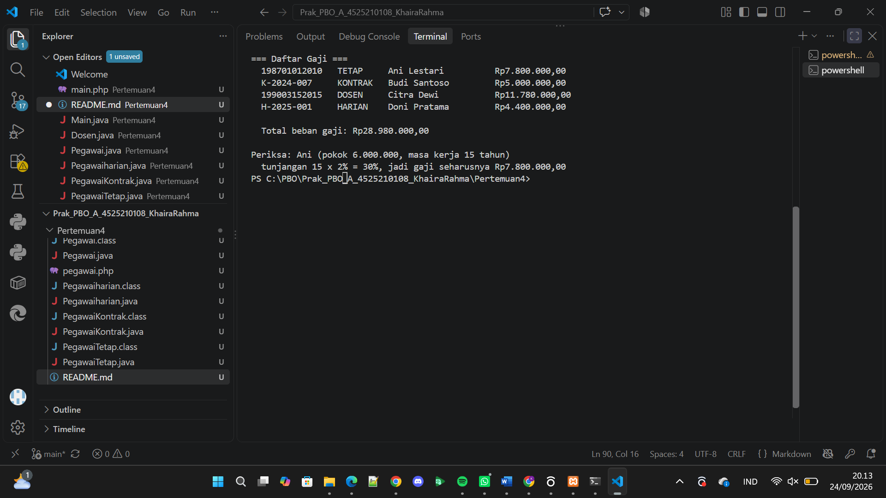 java
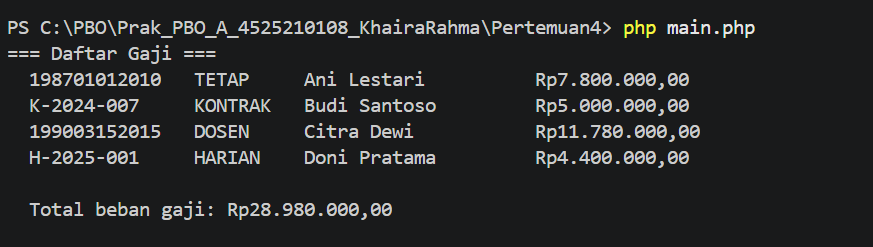 php

## Kesimpulan

Output menunjukkan empat jenis pegawai dihitung gajinya lewat **method yang sama** (`hitungGaji()`), tetapi hasilnya berbeda sesuai kelasnya:

- **Ani (Tetap):** 6.000.000 + tunjangan 30% (15 tahun x 2%) = **7.800.000**. Angka ini cocok dengan baris pemeriksaan di `Main`.
- **Budi (Kontrak):** **5.000.000**, gaji pokok saja karena tidak ada tunjangan.
- **Dosen:** gaji pokok ditambah tunjangan khusus dosen. Versi Java: 7.000.000 + (10 SKS x 150.000) = **8.500.000**. Versi PHP: 8.000.000 + tunjangan masa kerja 16% (8 tahun x 2%) + tunjangan fungsional 2.500.000 = **11.780.000**.
- **Harian:** upah per hari dikali hari kerja. Versi Java: 100.000 x 20 = **2.000.000**. Versi PHP: 200.000 x 22 = **4.400.000**.

1. **Pewarisan** membuat kode yang sama (nip, nama, gaji pokok, validasi, format cetak) cukup ditulis sekali di `Pegawai`, lalu dipakai semua turunan.
2. **Override + `super.` / `parent::`** memungkinkan turunan **menambah** perilaku induk tanpa menyalin rumusnya. Kalau rumus induk berubah, semua turunan ikut benar.
3. **`super(...)` / `parent::__construct(...)`** wajib dipanggil agar bagian induk objek terisi. Di Java, menghapusnya menyebabkan error kompilasi.
4. **Class `abstract`** menjamin `Pegawai` tidak bisa dibuat langsung dan memaksa setiap turunan menyebutkan `jenis()`-nya.
5. **Polimorfisme:** array bertipe `Pegawai` bisa menampung semua turunan, dan program tidak perlu memeriksa jenis satu per satu.