# LAPORAN PRAKTIKUM PEMROGRAMAN BERBASIS OBJEK

| Informasi Praktikan | Keterangan |
|---|---|
| **Nama** | Khaira Rahma Aprilliani|
| **NPM** | 4525210108 |
| **Kelas** | A |
| **Mata Kuliah** | Pemrograman Berbasis Objek (PBO) |
| **Pertemuan** | [05] - [Polimorfisme)] |
| **Tanggal** | [01-10-2026] |

## 1. Implementasi java

### 1.1 File Lingkaran.java

### Sebelum

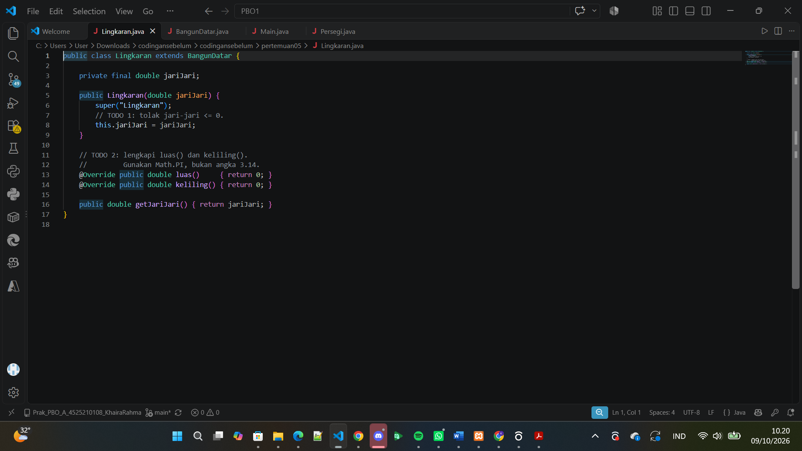

**Yang diminta:**

- **TODO 1**: constructor harus menolak jari-jari `<= 0`.
- **TODO 2**: lengkapi `luas()` dan `keliling()`. Gunakan `Math.PI`, **bukan** angka `3.14`.

**Kondisi kode awal:**

- `Lingkaran extends BangunDatar`, dengan properti `private final double jariJari`.
- Constructor memanggil `super("Lingkaran")`, lalu mengisi `jariJari` tanpa validasi.
- `luas()` dan `keliling()` masih `return 0;` sebagai nilai sementara.
- `getJariJari()` sudah ada.

### Setelah

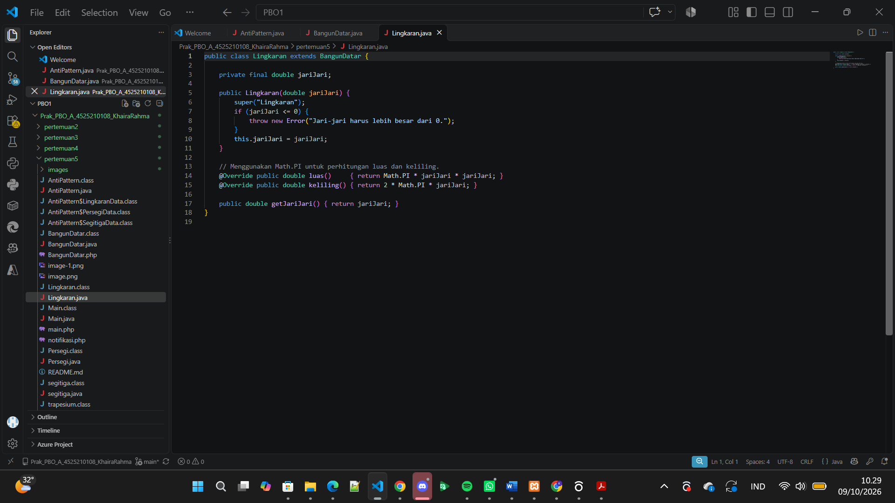

**Penjelasan kode:**

1. **Validasi (TODO 1).** `if (jariJari <= 0)` melempar `Error("Jari-jari harus lebih besar dari 0.")` sebelum nilai disimpan, sehingga objek lingkaran tidak mungkin punya jari-jari nol atau negatif.
2. **`luas()` (TODO 2).** `Math.PI * jariJari * jariJari`.
3. **`keliling()` (TODO 2).** `2 * Math.PI * jariJari`.
4. **Contoh.** Lingkaran(7): luas = 153,94 dan keliling = 43,98.

### 1.2 File Persegi.java

### Sebelum

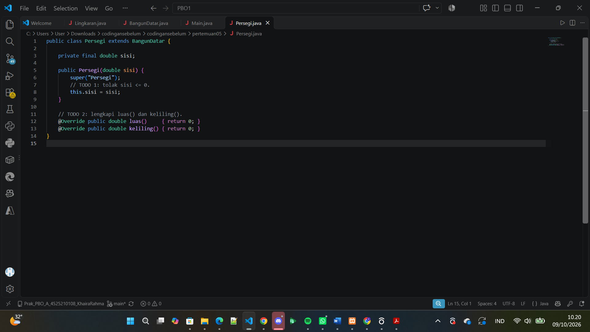

**Yang diminta:**

- **TODO 1**: constructor menolak sisi `<= 0`.
- **TODO 2**: lengkapi `luas()` dan `keliling()`.

**Kondisi kode awal:** properti `private final double sisi`, constructor dengan `super("Persegi")` tanpa validasi, serta `luas()` dan `keliling()` yang masih `return 0;`.

### Setelah

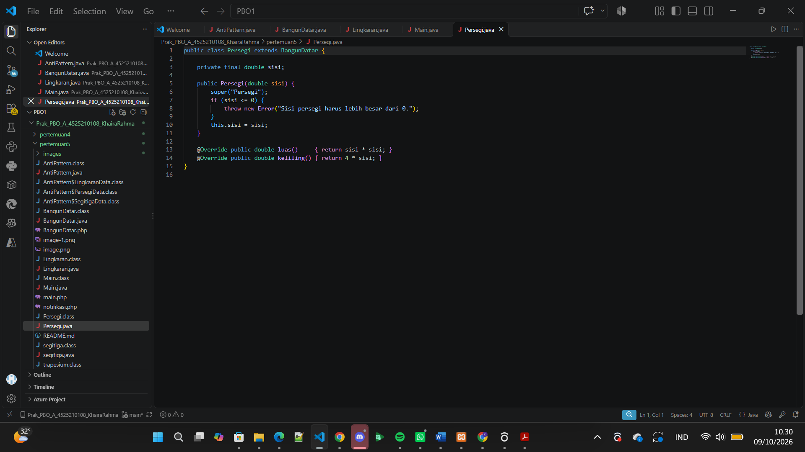

**Penjelasan kode:**

1. **Validasi (TODO 1).** `if (sisi <= 0)` melempar `Error("Sisi persegi harus lebih besar dari 0.")`.
2. **`luas()` (TODO 2).** `sisi * sisi`.
3. **`keliling()` (TODO 2).** `4 * sisi`.
4. **Contoh.** Persegi(5): luas = 25 dan keliling = 20.

---

### 1.3 File segitiga.java (kelas baru)

### Setelah

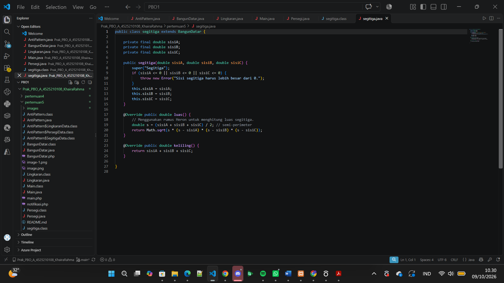

**Penjelasan kode:**

1. **Kelas baru (Langkah 2)** `segitiga extends BangunDatar` dengan tiga sisi: `sisiA`, `sisiB`, `sisiC`.
2. **Validasi.** Jika salah satu sisi `<= 0`, constructor melempar `Error("Sisi segitiga harus lebih besar dari 0.")`.
3. **`luas()` memakai rumus Heron:**
   - `s = (sisiA + sisiB + sisiC) / 2` (semi-perimeter)
   - `Math.sqrt(s * (s - sisiA) * (s - sisiB) * (s - sisiC))`
4. **`keliling()`** adalah `sisiA + sisiB + sisiC`.
5. **Contoh.** Segitiga(3, 4, 5): s = 6, luas = akar(6 x 3 x 2 x 1) = **6,00**, keliling = **12,00**.

### 1.4 File trapesium.java (kelas baru)

### Setelah

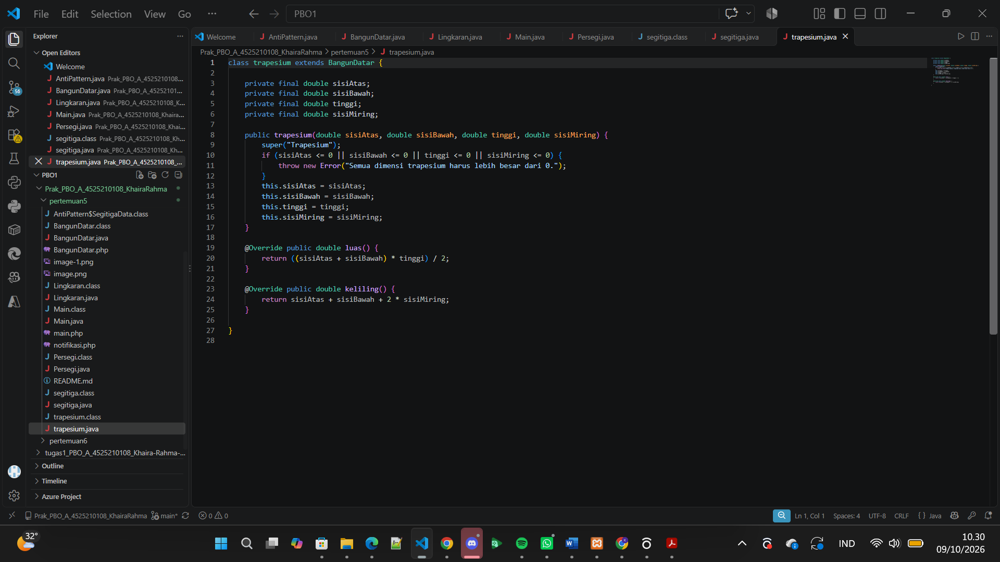

**Penjelasan kode:**

1. **Kelas baru (Langkah 4)** `trapesium extends BangunDatar` dengan properti `sisiAtas`, `sisiBawah`, `tinggi`, dan `sisiMiring`.
2. **Validasi.** Jika ada dimensi `<= 0`, constructor melempar `Error("Semua dimensi trapesium harus lebih besar dari 0.")`.
3. **`luas()`** adalah `((sisiAtas + sisiBawah) * tinggi) / 2`.
4. **`keliling()`** adalah `sisiAtas + sisiBawah + 2 * sisiMiring` (kedua kaki miring dianggap sama panjang).
5. **Contoh.** Trapesium(3, 4, 5, 6): luas = (7 x 5) / 2 = **17,50**, keliling = 3 + 4 + 2 x 6 = **19,00**.

### 1.5 File Main.java

### Sebelum

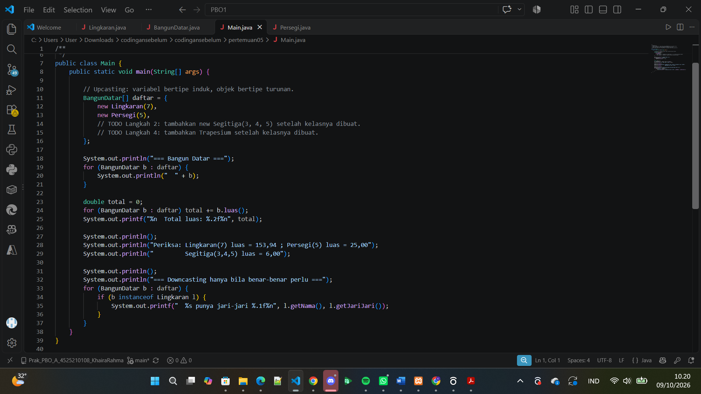

**Yang diminta:**

- **Langkah 2**: tambahkan `new Segitiga(3, 4, 5)` ke daftar setelah kelasnya dibuat.
- **Langkah 4**: tambahkan `Trapesium` ke daftar setelah kelasnya dibuat.
- **Aturan:** hanya boleh **menambah baris** ke dalam array. Logika perulangan di bawahnya **tidak boleh diubah sama sekali**. Kalau merasa perlu mengubahnya, berarti rancangan belum polimorfik.

**Kondisi kode awal:**

- *Upcasting*: `BangunDatar[] daftar` berisi `new Lingkaran(7)` dan `new Persegi(5)`.
- Perulangan `for` mencetak setiap bangun, lalu menjumlahkan `b.luas()` menjadi total luas.
- Baris pemeriksaan manual: luas Lingkaran(7) = 153,94, Persegi(5) = 25,00, Segitiga(3,4,5) = 6,00.
- *Downcasting*: perulangan dengan `instanceof Lingkaran l` untuk mencetak jari-jari, hanya pada objek yang memang lingkaran.

### Setelah

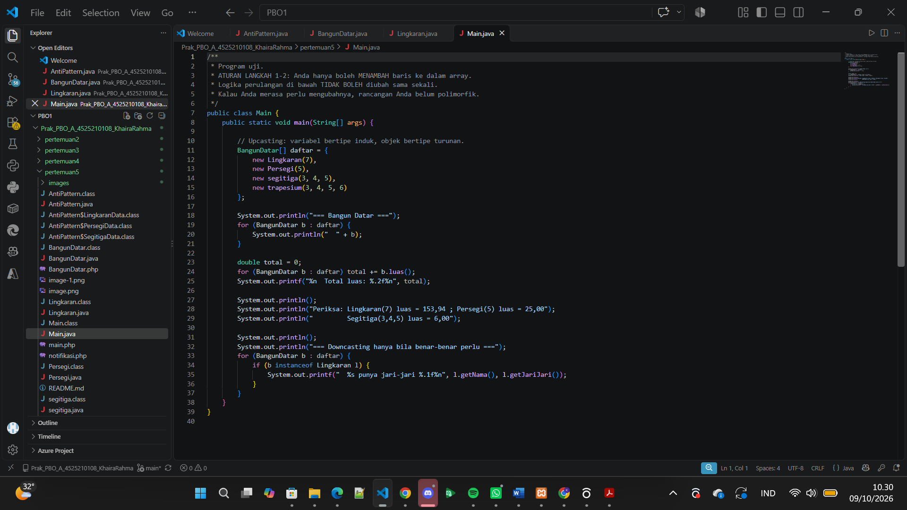

**Penjelasan kode:**

1. **Hanya array yang bertambah.** `new segitiga(3, 4, 5)` dan `new trapesium(3, 4, 5, 6)` ditambahkan ke `BangunDatar[] daftar`. Semua perulangan di bawahnya tidak disentuh.
2. **Polimorfisme.** `b.luas()` dan `System.out.println(b)` tetap benar untuk keempat jenis bangun, karena Java menjalankan versi `luas()`, `keliling()`, dan `toString()` milik objek yang sebenarnya.
3. **Downcasting seperlunya.** `if (b instanceof Lingkaran l)` dipakai hanya untuk `getJariJari()`, method yang cuma dimiliki lingkaran. Untuk `luas()` dan `keliling()` tidak perlu *cast* sama sekali.

 ### Screenshoot Main java
 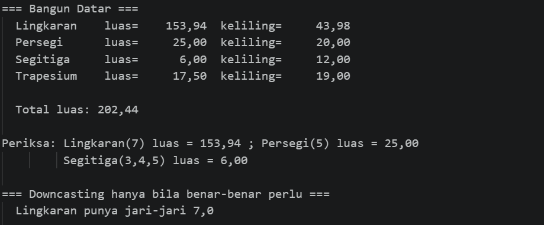

## 2. Implementasi php

### 2.1 File BangunDatar.php (semua class)

Seluruh hierarki bangun datar ditaruh dalam satu berkas.

### Sebelum

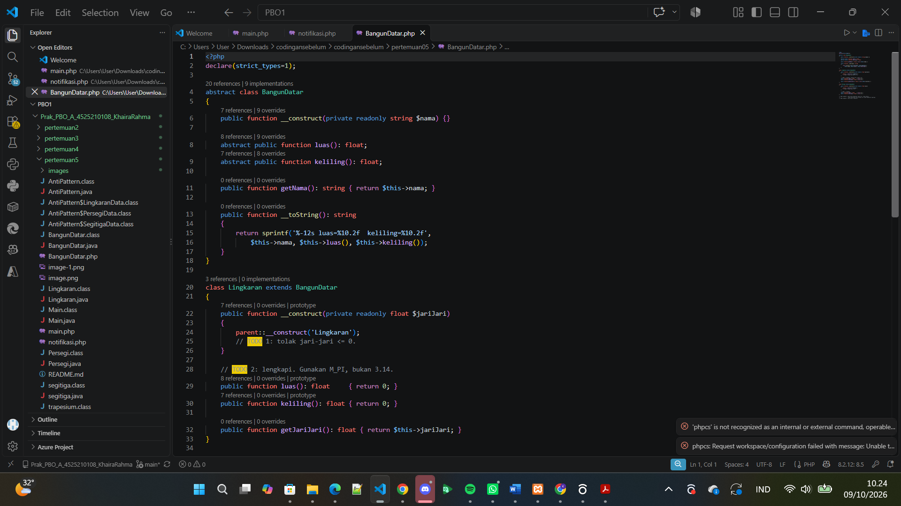

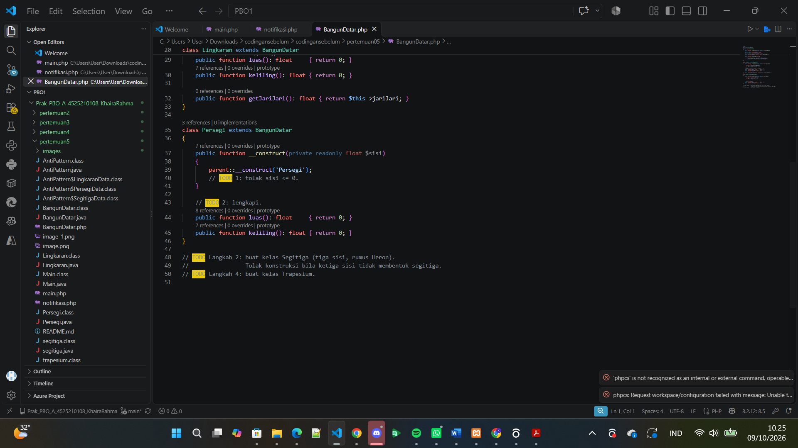

**Yang diminta:**

- **Lingkaran, TODO 1**: tolak jari-jari `<= 0`.
- **Lingkaran, TODO 2**: lengkapi `luas()` dan `keliling()` dengan `M_PI`, bukan `3.14`.
- **Persegi, TODO 1 dan 2**: tolak sisi `<= 0`, lalu lengkapi `luas()` dan `keliling()`.
- **Langkah 2**: buat kelas `Segitiga` (tiga sisi, rumus Heron) dan **tolak konstruksi bila ketiga sisi tidak membentuk segitiga**.
- **Langkah 4**: buat kelas `Trapesium`.

**Kondisi kode awal:**

- `abstract class BangunDatar` dengan constructor `private readonly string $nama`, dua method `abstract` (`luas()` dan `keliling()`), `getNama()`, dan `__toString()` berformat tabel.
- `Lingkaran` dan `Persegi` sudah ada, tetapi tanpa validasi, dan `luas()` serta `keliling()` masih `return 0;`.
- `Segitiga` dan `Trapesium` belum dibuat (masih berupa komentar).

### Setelah

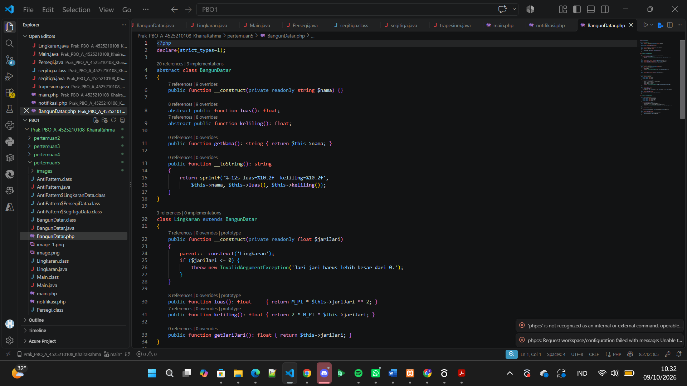

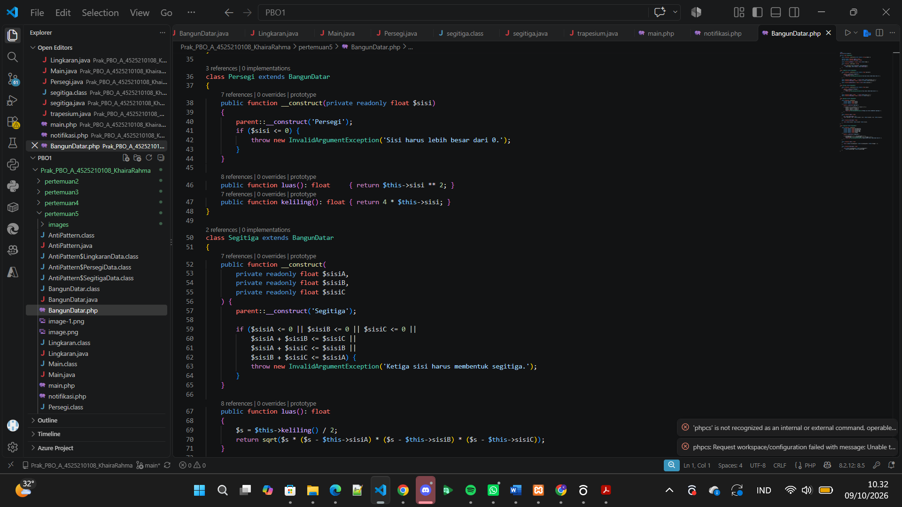

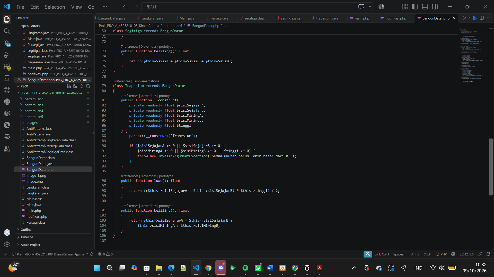

**Penjelasan kode:**

1. **`BangunDatar` (induk).** Kelas `abstract` dengan `luas()` dan `keliling()` bertipe `abstract`, sehingga setiap turunan **wajib** mengisinya. `__toString()` memakai `sprintf('%-12s luas=%10.2f  keliling=%10.2f', ...)` dan memanggil `luas()` serta `keliling()` milik objek yang sebenarnya.
2. **`Lingkaran`.** `if ($jariJari <= 0)` melempar `InvalidArgumentException('Jari-jari harus lebih besar dari 0.')`. `luas()` memakai `M_PI * $this->jariJari ** 2` dan `keliling()` memakai `2 * M_PI * $this->jariJari`.
3. **`Persegi`.** Menolak sisi `<= 0` (`'Sisi harus lebih besar dari 0.'`). `luas()` adalah `$this->sisi ** 2` dan `keliling()` adalah `4 * $this->sisi`.
4. **`Segitiga`.** Constructor menolak sisi `<= 0` **dan** memeriksa pertidaksamaan segitiga (`A + B > C`, `A + C > B`, `B + C > A`). Kalau gagal, melempar `'Ketiga sisi harus membentuk segitiga.'`. `luas()` memakai rumus Heron: `$s = $this->keliling() / 2`, lalu `sqrt($s * ($s - A) * ($s - B) * ($s - C))`. Perhatikan `luas()` memanggil `keliling()` milik kelasnya sendiri untuk mendapatkan semi-perimeter.
5. **`Trapesium`.** Lima parameter: dua sisi sejajar, dua sisi miring, dan tinggi. Menolak ukuran `<= 0`. `luas()` adalah `((A + B) * tinggi) / 2` dan `keliling()` adalah jumlah keempat sisi.
6. **Properti `readonly`** dengan *constructor promotion* membuat semua ukuran tidak bisa diubah setelah objek dibuat.

### 2.2 File main.php

### Sebelum

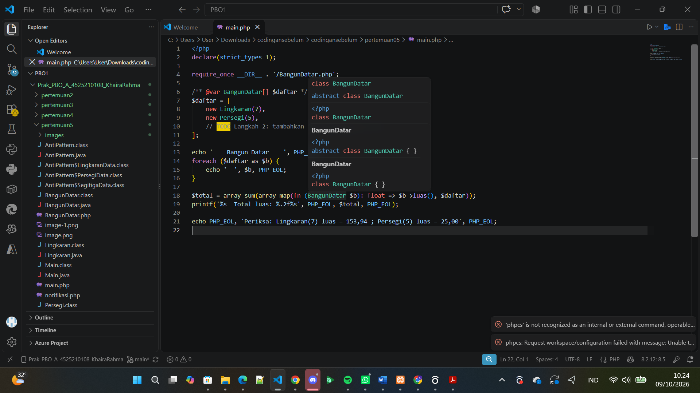

**Yang diminta:**

- **Langkah 2**: tambahkan `new Segitiga(3, 4, 5)` ke daftar setelah kelasnya dibuat.

**Kondisi kode awal:** `$daftar` baru berisi `Lingkaran(7)` dan `Persegi(5)`, dengan `require_once` ke `BangunDatar.php`, `foreach` untuk mencetak, `array_sum(array_map(...))` untuk total luas, dan baris pemeriksaan manual.

### Setelah

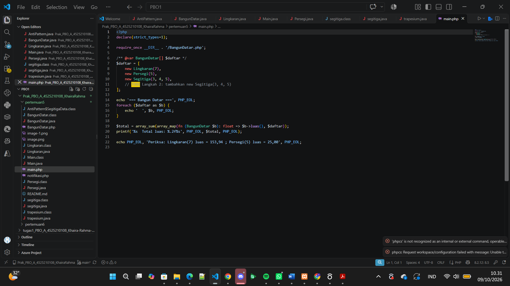

**Penjelasan kode:**

1. **`new Segitiga(3, 4, 5)`** ditambahkan ke `$daftar`, tanpa mengubah perulangan.
2. **`echo $b`** memanggil `__toString()` milik tiap objek, dan **`$b->luas()`** di dalam `array_map` memanggil versi `luas()` milik objek masing-masing (polimorfisme).
3. **Tipe parameter `BangunDatar $b`** pada fungsi panah menerima semua turunannya.

### 2.3 File notifikasi.php

Latihan mandiri (Langkah 6): bangun hierarki sendiri, lalu tulis `kirimSemua()` **tanpa satu pun pemeriksaan tipe**.

### Sebelum

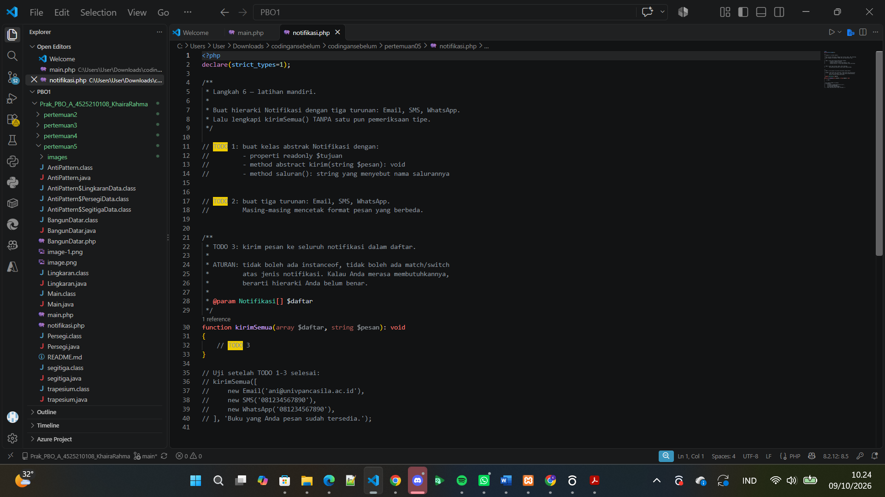

**Yang diminta:**

- **TODO 1**: buat kelas abstrak `Notifikasi` dengan properti `readonly $tujuan`, method `abstract kirim(string $pesan): void`, dan method `saluran(): string` yang menyebut nama salurannya.
- **TODO 2**: buat tiga turunan: `Email`, `SMS`, `WhatsApp`, masing-masing mencetak format pesan.
- **TODO 3**: lengkapi `kirimSemua(array $daftar, string $pesan): void` untuk mengirim pesan ke seluruh notifikasi dalam daftar.
- **Aturan:** tidak boleh ada `instanceof`, dan tidak boleh ada `match`/`switch` atas jenis notifikasi. Kalau merasa membutuhkannya, berarti hierarkinya belum benar.

**Kondisi kode awal:** hanya berisi komentar petunjuk, fungsi `kirimSemua()` yang kosong (`// TODO 3`), dan contoh pemakaian yang masih dikomentari.

### Setelah

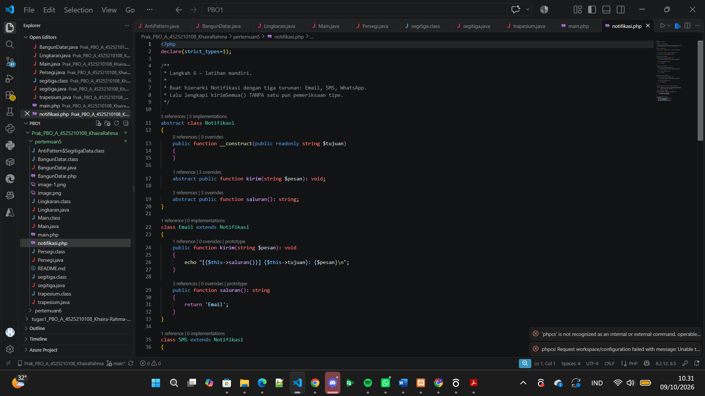

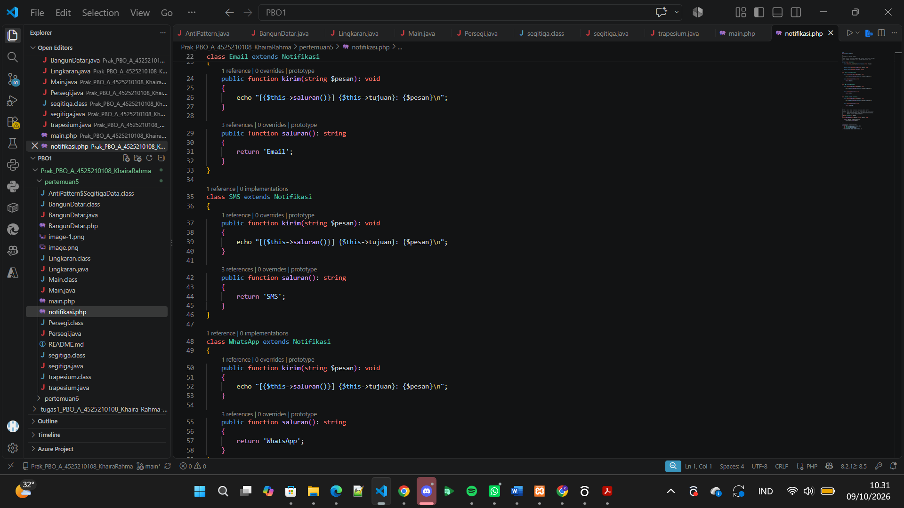

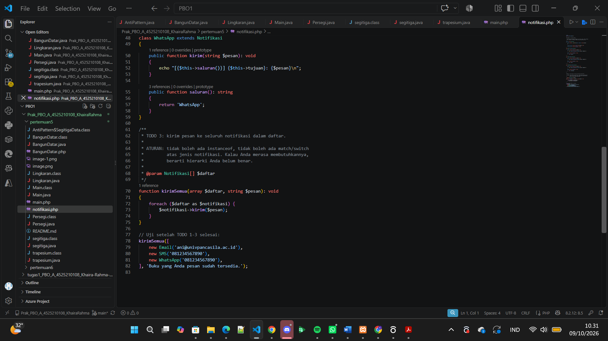

**Penjelasan kode:**

1. **`Notifikasi` (TODO 1).** Kelas `abstract` dengan `public readonly string $tujuan` (via *constructor promotion*), `abstract public function kirim(string $pesan): void`, dan `abstract public function saluran(): string`.
2. **`Email`, `SMS`, `WhatsApp` (TODO 2).** Ketiganya `extends Notifikasi`. `saluran()` mengembalikan `'Email'`, `'SMS'`, atau `'WhatsApp'`, dan `kirim()` mencetak `[saluran] tujuan: pesan`.
3. **`kirimSemua()` (TODO 3).** Cukup `foreach ($daftar as $notifikasi) { $notifikasi->kirim($pesan); }`. Tidak ada `instanceof`, `match`, maupun `switch`, jadi aturan terpenuhi.
4. **Menambah saluran baru** (misalnya Telegram) cukup membuat satu kelas turunan baru. `kirimSemua()` tidak perlu diubah sama sekali.
5. **Pengujian.** `kirimSemua([...], 'Buku yang Anda pesan sudah tersedia.')` dipanggil dengan satu `Email`, satu `SMS`, dan satu `WhatsApp`.

 

 ### Screenshoot Main php
 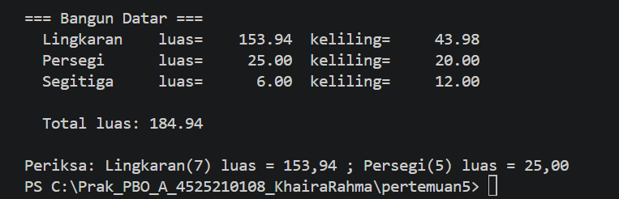

## Penjelasan dan kesimpulan:

- **Bangun datar:** daftar bertipe `BangunDatar` berisi berbagai bentuk, tetapi satu perulangan yang sama menghitung luas dan keliling semuanya. Total luas Java 202,44 = 153,94 + 25 + 6 + 17,5. Total luas PHP 184,94 = 153,94 + 25 + 6 (Trapesium belum dimasukkan ke daftar `main.php`).
- **Notifikasi:** satu panggilan `kirimSemua()` mengirim lewat tiga saluran berbeda tanpa satu pun `if`, `instanceof`, atau `switch`.

**Kesimpulan:**

1. **Polimorfisme** berarti satu pemanggilan method (`luas()`, `kirim()`) menghasilkan perilaku yang sesuai dengan jenis objek sebenarnya, tanpa kode yang memeriksa jenisnya.
2. **Class `abstract`** memaksa setiap turunan mengisi method inti, sehingga semua turunan pasti punya `luas()` dan `keliling()` (atau `kirim()` dan `saluran()`).
3. **Mudah dikembangkan.** Menambah Segitiga atau Trapesium hanya perlu kelas baru dan satu baris di array. Menambah saluran notifikasi baru hanya perlu satu kelas baru. Kode perulangan yang sudah ada tidak disentuh.
4. **Upcasting** (variabel bertipe induk, objek bertipe turunan) membuat satu array bisa menampung semua jenis. **Downcasting** (`instanceof Lingkaran l`) hanya dipakai bila benar-benar butuh method khusus turunan, seperti `getJariJari()`.
5. **Validasi di constructor** membuat objek yang tidak masuk akal (jari-jari negatif, sisi yang tidak membentuk segitiga) tidak bisa terbentuk sejak awal.
