# LAPORAN PRAKTIKUM PEMROGRAMAN BERBASIS OBJEK

| Informasi Praktikan | Keterangan |
|---|---|
| **Nama** | Khaira Rahma Aprilliani|
| **NPM** | 4525210108 |
| **Kelas** | A |
| **Mata Kuliah** | Pemrograman Berbasis Objek (PBO) |
| **Pertemuan** | [06] - [Abstract Class, Interface, Enum, dan Trait] |
| **Tanggal** | [08-10-2026] |

## 1. Implementasi Java

### 1.1 File Kendaraan.java

### Sebelum

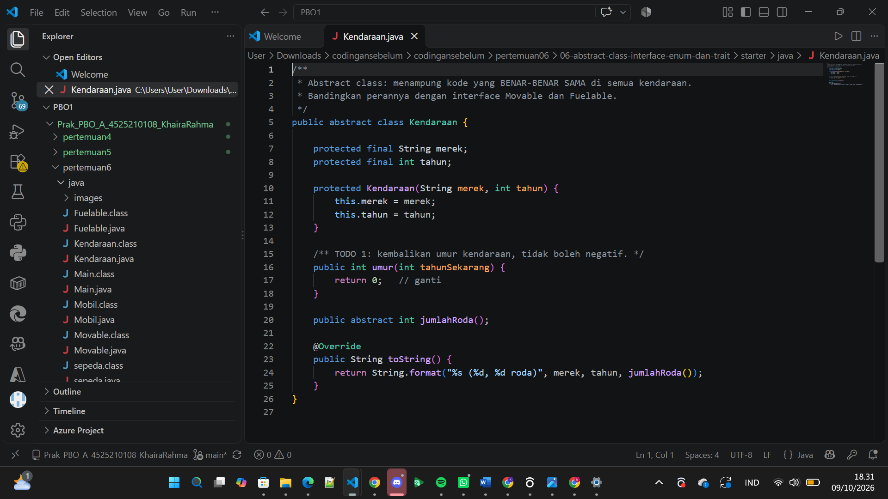

**Yang diminta:**

- `Kendaraan` adalah **abstract class** yang menampung kode yang benar-benar sama di semua kendaraan. Bandingkan perannya dengan interface `Movable` dan `Fuelable`.
- **TODO 1**: method `umur(int tahunSekarang)` mengembalikan umur kendaraan dan tidak boleh negatif.

**Kondisi kode awal:** properti `protected final String merek` dan `int tahun`, constructor `protected`, method `abstract int jumlahRoda()`, dan `toString()` berformat `"%s (%d, %d roda)"`. Method `umur()` masih `return 0;`.

### Setelah

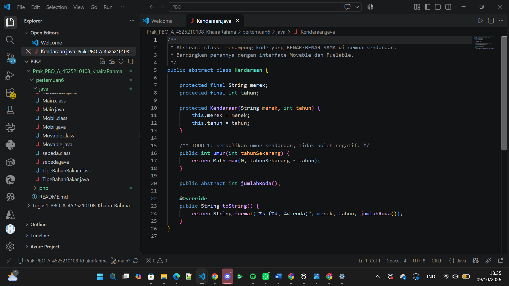

**Penjelasan kode:**

1. **`umur()` (TODO 1)** sekarang `return Math.max(0, tahunSekarang - tahun);`. Kalau tahun sekarang lebih kecil dari tahun pembuatan, hasilnya 0, bukan angka negatif.
2. **`jumlahRoda()` tetap `abstract`**, sehingga setiap turunan wajib menentukan jumlah rodanya sendiri.
3. **`toString()`** memanggil `jumlahRoda()` milik objek yang sebenarnya, jadi hasilnya benar untuk Mobil maupun Sepeda.

### 1.2 File Movable.java

### Sebelum

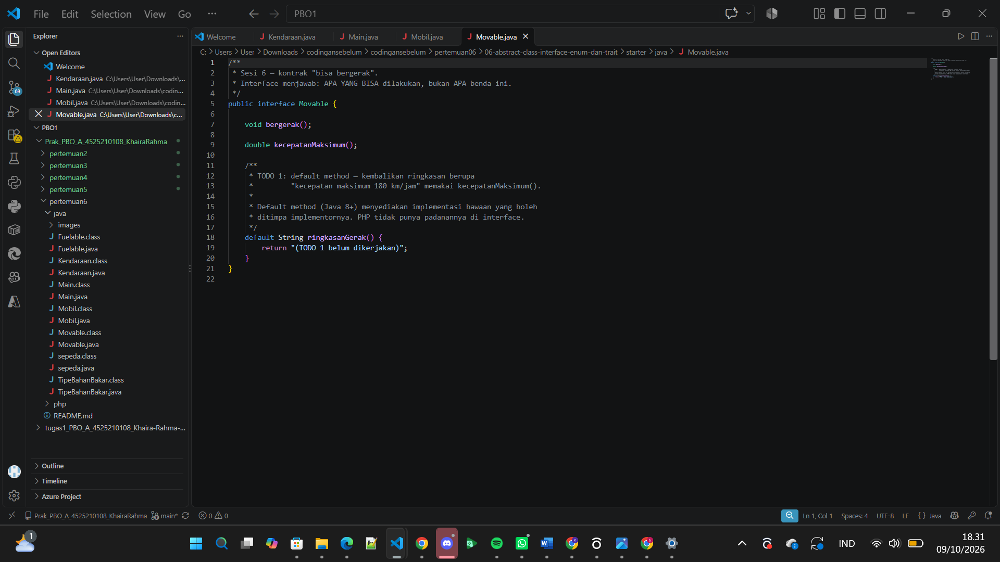

**Yang diminta:**

- Interface menjawab "**apa yang bisa dilakukan**", bukan "apa benda ini".
- **TODO 1**: lengkapi *default method* `ringkasanGerak()` supaya mengembalikan ringkasan "kecepatan maksimum 180 km/jam" dengan memakai `kecepatanMaksimum()`. *Default method* (Java 8+) adalah implementasi bawaan di interface yang boleh ditimpa. PHP tidak punya padanannya di interface.

**Kondisi kode awal:** dua method abstrak `void bergerak()` dan `double kecepatanMaksimum()`, serta `default String ringkasanGerak()` yang masih `return "(TODO 1 belum dikerjakan)";`.

### Setelah

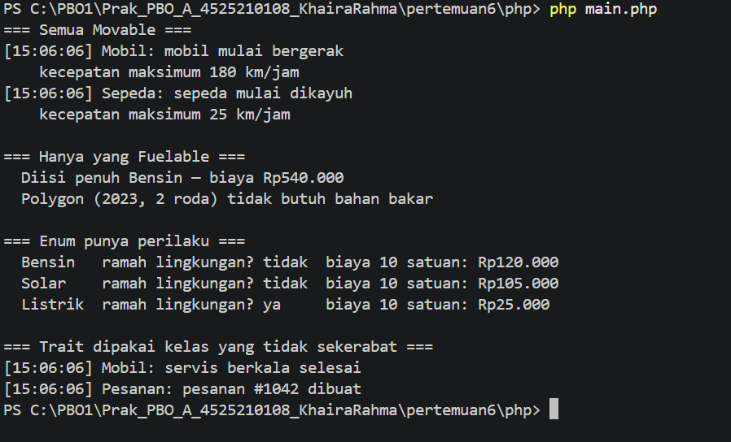

**Penjelasan kode:**

1. **Default method (TODO 1).** `ringkasanGerak()` menyusun teks ringkasan dari `kecepatanMaksimum()`, sehingga kelas yang implement `Movable` otomatis punya ringkasan tanpa menulisnya sendiri.
2. Karena memanggil `kecepatanMaksimum()` yang abstrak, hasil ringkasannya berbeda untuk tiap kelas (Mobil 180, Sepeda 30).

### 1.3 File Mobil.java

### Sebelum

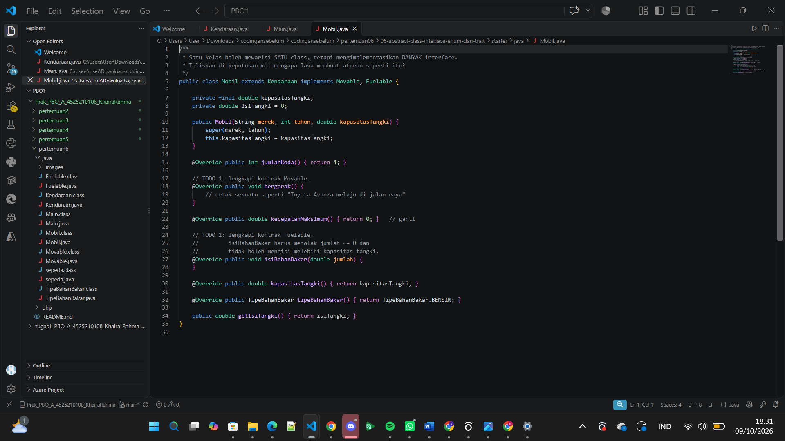

**Yang diminta:**

- Satu kelas boleh **mewarisi satu class** tetapi **mengimplementasikan banyak interface**. Alasan Java membuat aturan seperti itu dituliskan di `keputusan.md`.
- **TODO 1**: lengkapi kontrak `Movable`: `bergerak()` mencetak kalimat seperti "Toyota Avanza melaju di jalan raya", dan `kecepatanMaksimum()` mengembalikan nilai yang benar.
- **TODO 2**: lengkapi kontrak `Fuelable`: `isiBahanBakar()` harus menolak jumlah `<= 0` dan tidak boleh mengisi melebihi kapasitas tangki.

**Kondisi kode awal:** `Mobil extends Kendaraan implements Movable, Fuelable`, dengan `kapasitasTangki` dan `isiTangki`. `bergerak()` dan `isiBahanBakar()` masih kosong, `kecepatanMaksimum()` masih `return 0;`. `jumlahRoda()` (4), `kapasitasTangki()`, `tipeBahanBakar()` (BENSIN), dan `getIsiTangki()` sudah ada.

### Setelah

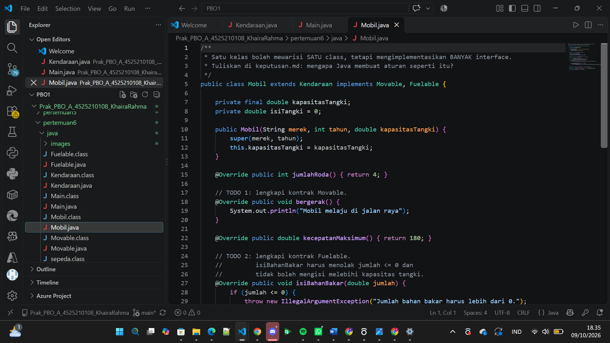

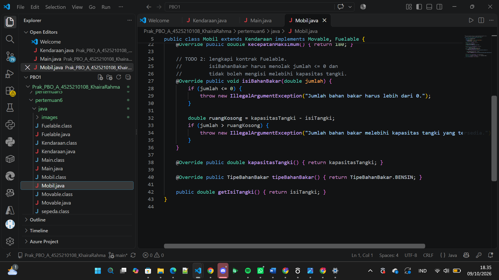

**Penjelasan kode:**

1. **`bergerak()` (TODO 1)** mencetak `"Mobil melaju di jalan raya"`.
2. **`kecepatanMaksimum()` (TODO 1)** mengembalikan `180`.
3. **`isiBahanBakar()` (TODO 2)** punya dua penjagaan:
   - `if (jumlah <= 0)` melempar `IllegalArgumentException("Jumlah bahan bakar harus lebih dari 0.")`
   - `double ruangKosong = kapasitasTangki - isiTangki;` lalu `if (jumlah > ruangKosong)` melempar `IllegalArgumentException("Jumlah bahan bakar melebihi kapasitas tangki yang tersedia.")`
4. **Satu class, banyak interface.** `Mobil` mewarisi `Kendaraan` (apa dia) sekaligus implement `Movable` (bisa bergerak) dan `Fuelable` (butuh bahan bakar).

### 1.4 File TipeBahanBakar.java

### Sebelum

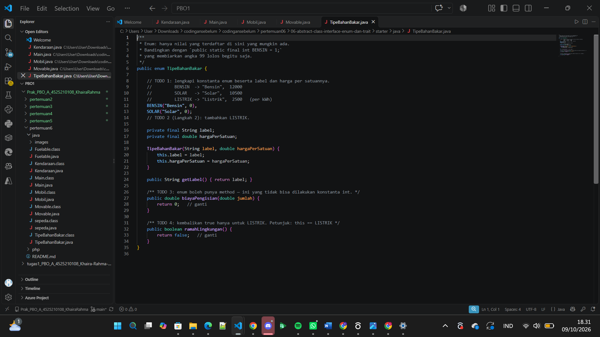

**Yang diminta:**

- **Enum**: hanya nilai yang terdaftar di dalamnya yang mungkin ada. Bandingkan dengan `public static final int BENSIN = 1;` yang membiarkan angka 99 lolos begitu saja.
- **TODO 1**: lengkapi konstanta enum beserta label dan harga per satuan: `BENSIN` ("Bensin", 12000), `SOLAR` ("Solar", 10500), `LISTRIK` ("Listrik", 2500 per kWh).
- **TODO 2 (Langkah 2)**: tambahkan `LISTRIK`.
- **TODO 3**: `biayaPengisian(double jumlah)`. Enum boleh punya method, ini yang tidak bisa dilakukan konstanta `int`.
- **TODO 4**: `ramahLingkungan()` mengembalikan `true` hanya untuk `LISTRIK`. Petunjuk: `this == LISTRIK`.

**Kondisi kode awal:** `BENSIN("Bensin", 0)` dan `SOLAR("Solar", 0)` dengan harga masih 0, `LISTRIK` belum ada, `biayaPengisian()` masih `return 0;`, dan `ramahLingkungan()` masih `return false;`.

### Setelah

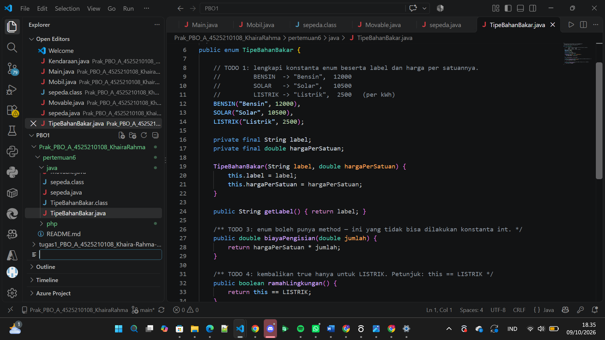

**Penjelasan kode:**

1. **Konstanta (TODO 1 dan 2).** `BENSIN("Bensin", 12000)`, `SOLAR("Solar", 10500)`, dan `LISTRIK("Listrik", 2500)`. Tiga nilai inilah satu-satunya yang mungkin.
2. **`biayaPengisian()` (TODO 3).** `return hargaPerSatuan * jumlah;`. Biaya dihitung dari harga milik masing-masing konstanta.
3. **`ramahLingkungan()` (TODO 4).** `return this == LISTRIK;`. Enum aman dibandingkan dengan `==` karena tiap konstanta hanya ada satu objeknya.
4. **Contoh.** Biaya 10 satuan: Bensin Rp120.000, Solar Rp105.000, Listrik Rp25.000.

### 1.5 File sepeda.java (kelas baru)

### Setelah

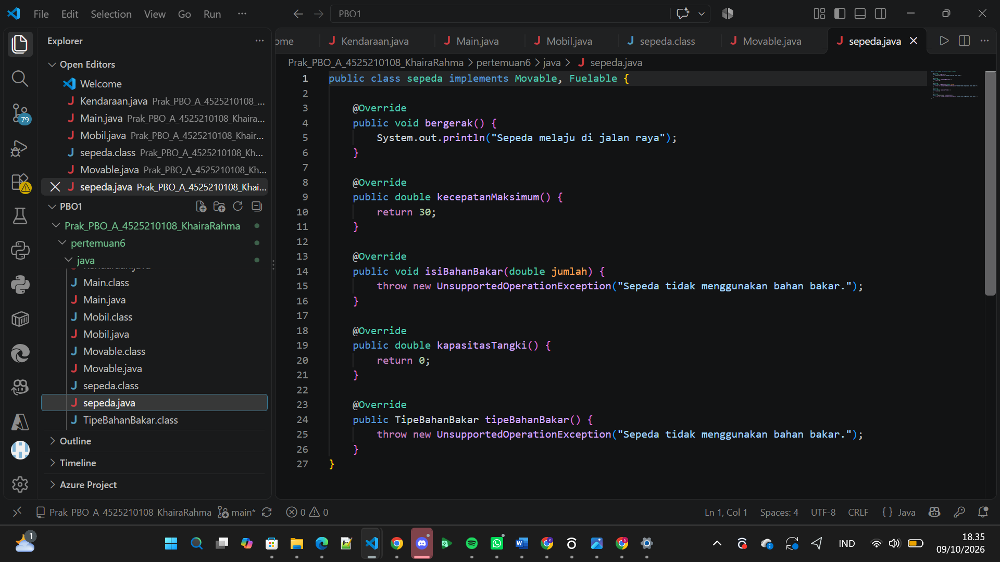

**Penjelasan kode:**

1. **Kelas baru (Langkah 4)** `sepeda implements Movable, Fuelable`.
2. **`bergerak()`** mencetak `"Sepeda melaju di jalan raya"`, dan **`kecepatanMaksimum()`** mengembalikan `30`.
3. **Method `Fuelable`.** `isiBahanBakar()` dan `tipeBahanBakar()` melempar `UnsupportedOperationException("Sepeda tidak menggunakan bahan bakar.")`, sedangkan `kapasitasTangki()` mengembalikan `0`.

### Output
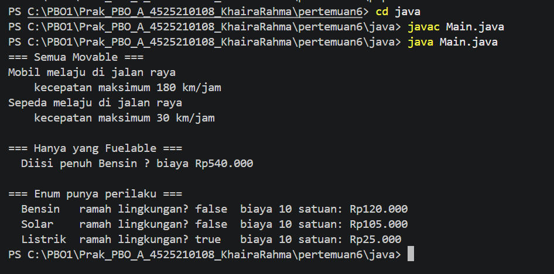

### 1.6 File Main.java

### Sebelum

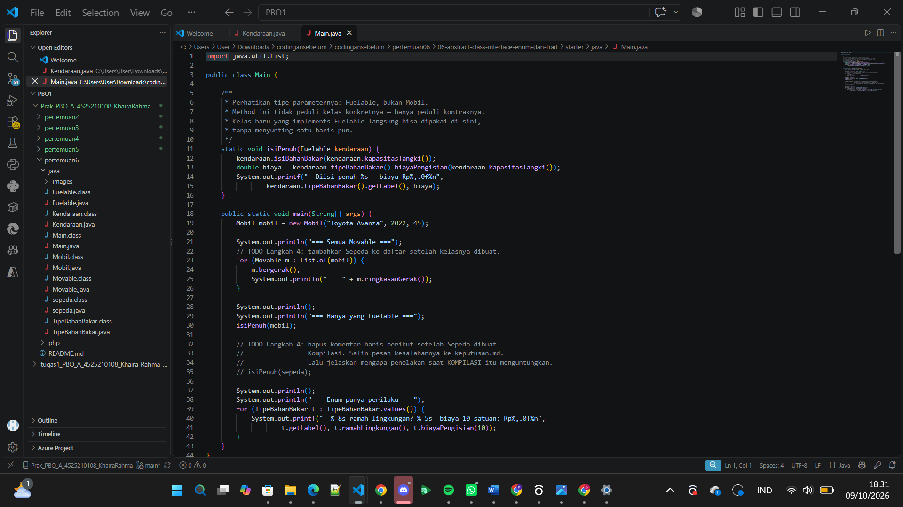

**Yang diminta:**

- **Langkah 4**: tambahkan `Sepeda` ke daftar `Movable` setelah kelasnya dibuat.
- **Langkah 4**: hapus komentar pada baris `isiPenuh(sepeda);`, kompilasi, salin pesan kesalahannya ke `keputusan.md`, lalu jelaskan mengapa **penolakan saat kompilasi** itu menguntungkan.

**Kondisi kode awal:**

- `static void isiPenuh(Fuelable kendaraan)` menerima tipe **`Fuelable`**, bukan `Mobil`. Method ini tidak peduli kelas konkretnya, hanya kontraknya.
- `main()` membuat `Mobil("Toyota Avanza", 2022, 45)`, lalu perulangan `for (Movable m : List.of(mobil))`.
- Bagian "Hanya yang Fuelable" memanggil `isiPenuh(mobil)`.
- Bagian "Enum punya perilaku" menampilkan label, status ramah lingkungan, dan biaya 10 satuan untuk tiap `TipeBahanBakar`.

### Setelah

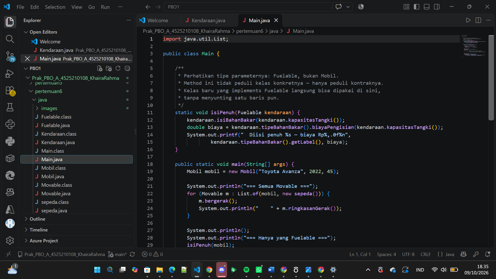

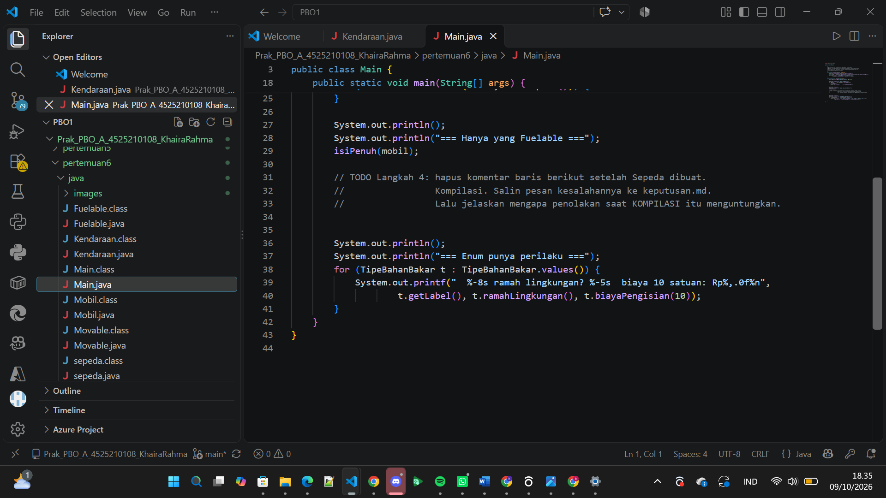

**Penjelasan kode:**

1. **`isiPenuh(Fuelable kendaraan)`** mengisi tangki sampai penuh, menghitung biaya lewat `tipeBahanBakar().biayaPengisian(...)`, lalu mencetaknya. Kelas baru apa pun yang implement `Fuelable` langsung bisa dipakai tanpa mengubah satu baris pun di sini.
2. **`List.of(mobil, new sepeda())`** memasukkan sepeda ke daftar `Movable` (Langkah 4). Perulangan memanggil `bergerak()` dan `ringkasanGerak()` untuk keduanya.
3. **Baris `isiPenuh(sepeda);`** tidak lagi ada di kode.
4. **Enum.** `TipeBahanBakar.values()` mengembalikan semua nilai enum untuk dicetak.

## 2. Implementasi PHP

### 2.1 File abstraksi.php (semua tipe)

Interface, enum, trait, abstract class, dan semua kelas ditaruh dalam satu berkas agar mudah dibaca berdampingan dengan versi Java.

### Sebelum

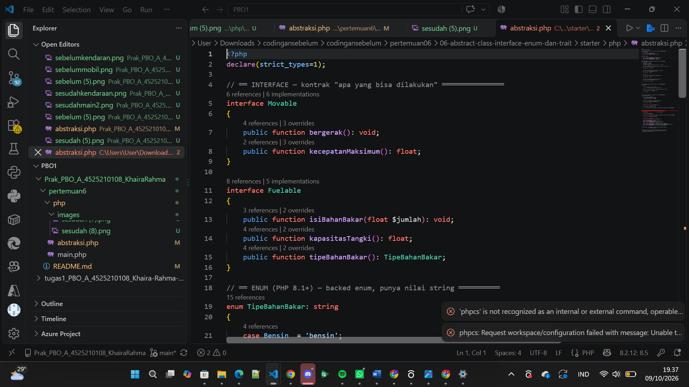

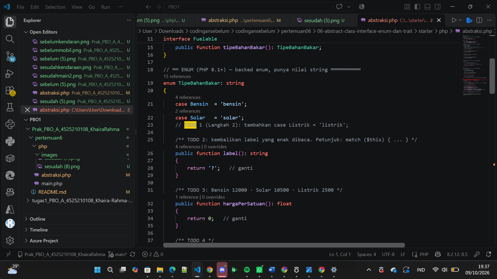

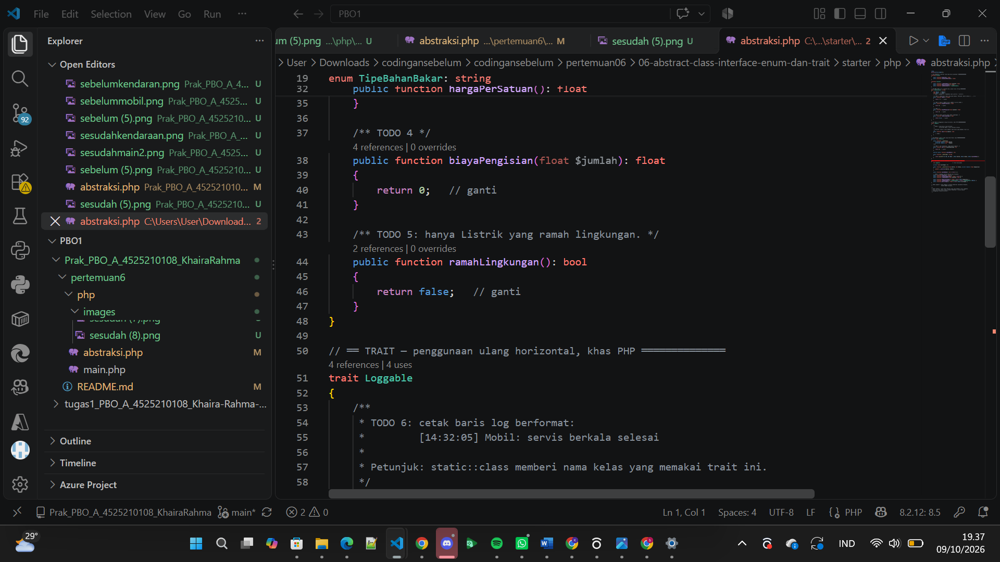

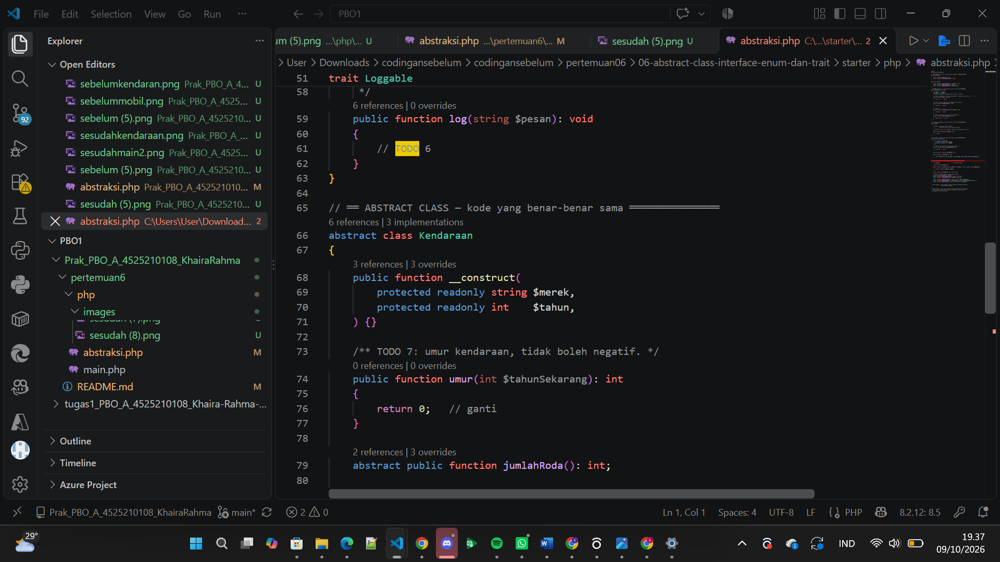

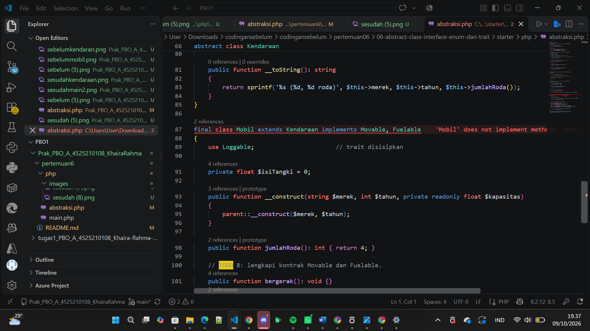

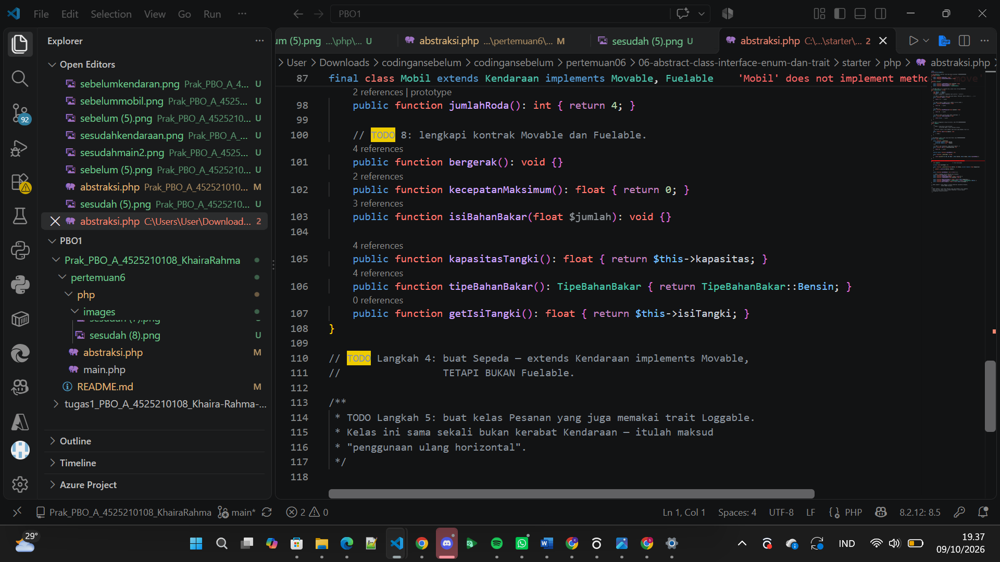

**Yang diminta:**

- **TODO 1**: tambahkan `case Listrik = 'listrik'` ke enum (Langkah 2).
- **TODO 2**: `label()` mengembalikan label enak dibaca. Petunjuk: `match ($this) { ... }`.
- **TODO 3**: `hargaPerSatuan()`: Bensin 12000, Solar 10500, Listrik 2500.
- **TODO 4**: `biayaPengisian(float $jumlah)`.
- **TODO 5**: `ramahLingkungan()`, hanya Listrik yang ramah lingkungan.
- **TODO 6**: trait `Loggable`: `log(string $pesan)` mencetak baris berformat `[14:32:05] Mobil: servis berkala selesai`. Petunjuk: `static::class` memberi nama kelas yang memakai trait ini.
- **TODO 7**: `Kendaraan::umur()` tidak boleh negatif.
- **TODO 8**: lengkapi kontrak `Movable` dan `Fuelable` di `Mobil`.
- **Langkah 4**: buat `Sepeda extends Kendaraan implements Movable`, **tetapi bukan `Fuelable`**.
- **Langkah 5**: buat kelas `Pesanan` yang juga memakai trait `Loggable`. Kelas ini sama sekali bukan kerabat `Kendaraan`, dan itulah maksud "penggunaan ulang horizontal".

**Kondisi kode awal:**

- Interface `Movable` (`bergerak()`, `kecepatanMaksimum()`) dan `Fuelable` (`isiBahanBakar()`, `kapasitasTangki()`, `tipeBahanBakar()`) sudah ada.
- `enum TipeBahanBakar: string` baru punya `Bensin` dan `Solar`. `label()` masih `return '?'`, sedangkan `hargaPerSatuan()` dan `biayaPengisian()` masih `return 0`, dan `ramahLingkungan()` masih `return false`.
- Trait `Loggable::log()` masih berupa `// TODO 6`, dan `Kendaraan::umur()` masih `return 0`.
- `final class Mobil` sudah `use Loggable`, tetapi `bergerak()`, `kecepatanMaksimum()`, dan `isiBahanBakar()` masih kosong. `Sepeda` dan `Pesanan` belum dibuat.

### Setelah

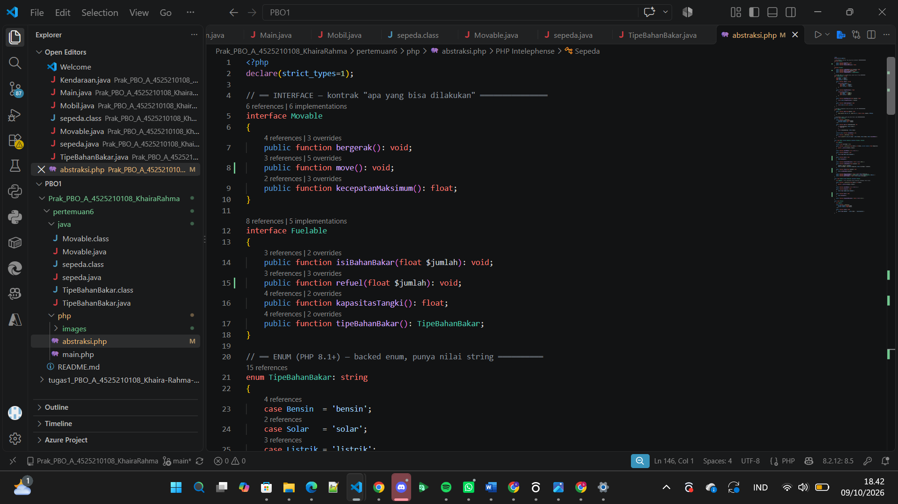

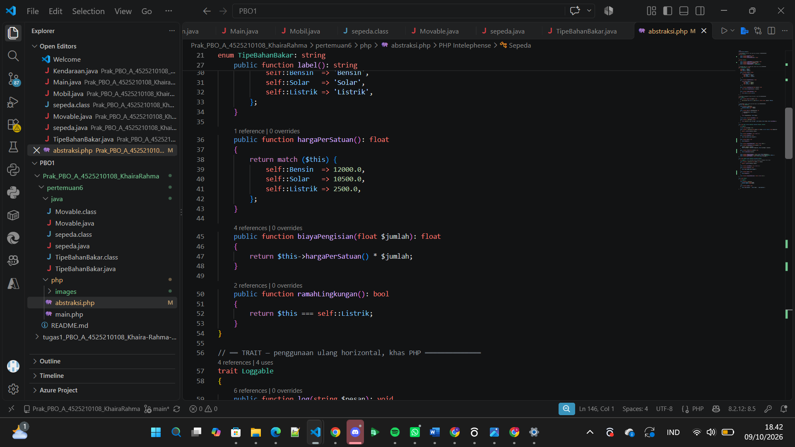

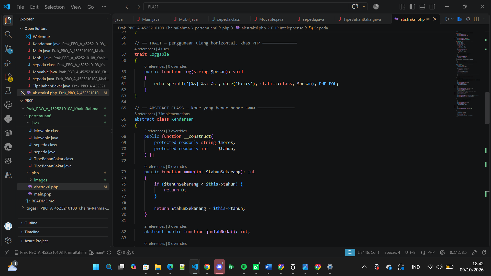

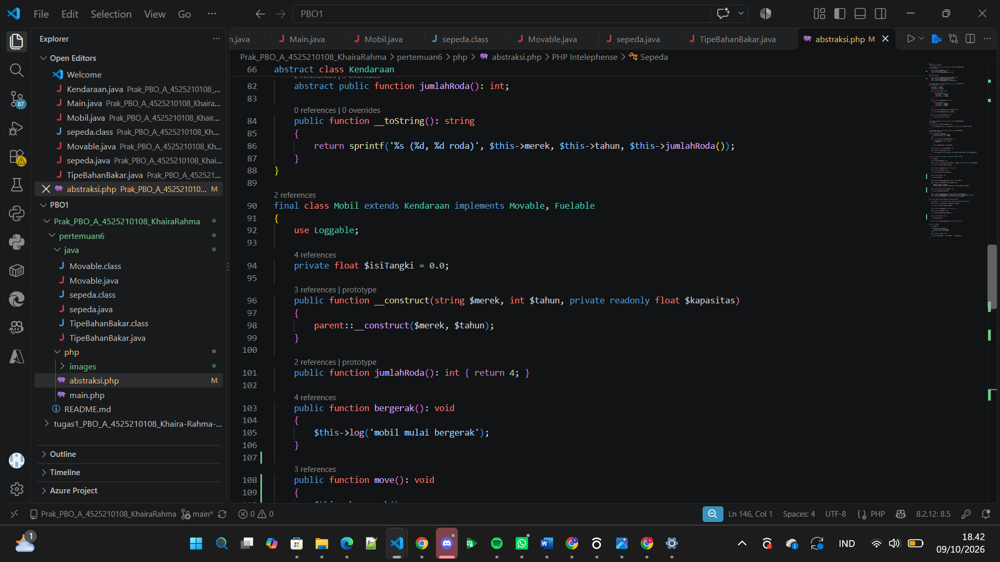

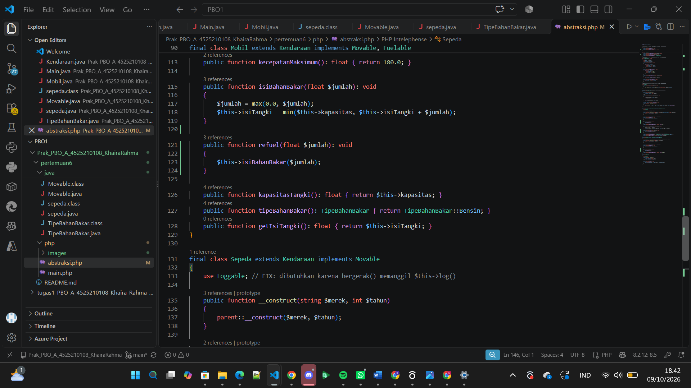

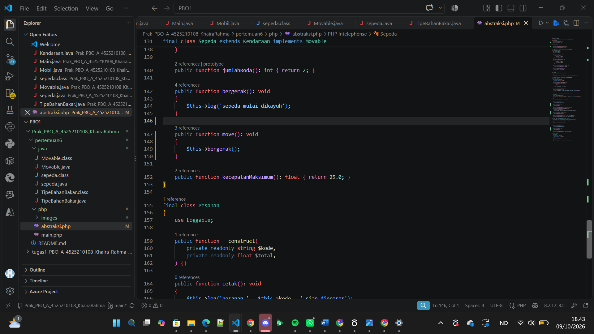

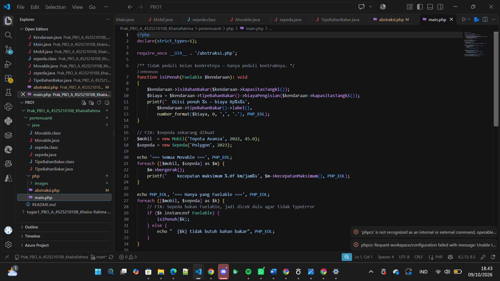

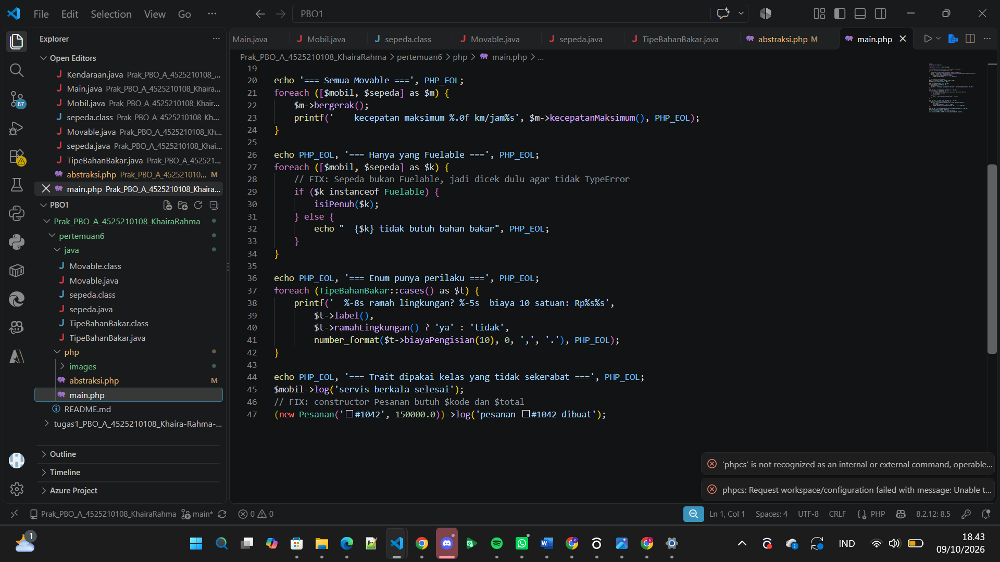

**Penjelasan kode:**

1. **Interface.** `Movable` berisi `bergerak()`, `move()`, dan `kecepatanMaksimum()`. `Fuelable` berisi `isiBahanBakar()`, `refuel()`, `kapasitasTangki()`, dan `tipeBahanBakar()`. Method `move()` dan `refuel()` adalah nama alias berbahasa Inggris yang meneruskan ke `bergerak()` dan `isiBahanBakar()`.
2. **Enum (TODO 1-5).** `enum TipeBahanBakar: string` kini punya tiga `case` (Bensin, Solar, Listrik). `label()` dan `hargaPerSatuan()` memakai `match ($this)`. `biayaPengisian()` mengalikan `hargaPerSatuan()` dengan jumlah, dan `ramahLingkungan()` adalah `$this === self::Listrik`.
3. **Trait `Loggable` (TODO 6).** `log()` mencetak `sprintf('[%s] %s: %s', date('H:i:s'), static::class, $pesan)`. `static::class` menghasilkan nama kelas yang **memakai** trait, jadi tampil `Mobil`, `Sepeda`, atau `Pesanan`.
4. **`Kendaraan` (TODO 7).** `umur()` mengembalikan 0 kalau `$tahunSekarang < $this->tahun`, selain itu selisih tahunnya. Properti `protected readonly` lewat *constructor promotion*.
5. **`Mobil` (TODO 8).** `bergerak()` memanggil `$this->log('mobil mulai bergerak')`, `kecepatanMaksimum()` mengembalikan `180.0`, dan `isiBahanBakar()` memakai `max(0.0, $jumlah)` lalu `min($this->kapasitas, $this->isiTangki + $jumlah)`, yaitu menjaga isi tangki antara 0 dan kapasitas. `refuel()` meneruskan ke `isiBahanBakar()`.
6. **`Sepeda` (Langkah 4).** `final class Sepeda extends Kendaraan implements Movable`: **hanya `Movable`**, tidak `Fuelable`. Memakai `use Loggable` karena `bergerak()` memanggil `$this->log()`. `jumlahRoda()` mengembalikan 2, `bergerak()` mencatat `'sepeda mulai dikayuh'`, dan `kecepatanMaksimum()` mengembalikan `25.0`.
7. **`Pesanan` (Langkah 5).** `final class Pesanan` dengan `use Loggable`, properti `kode` dan `total`, dan `cetak()` yang mencatat `'pesanan <kode> siap diproses'`. Kelas ini tidak mewarisi apa pun, tetapi tetap bisa `log()` berkat trait.

### 2.2 File main.php

### Sebelum

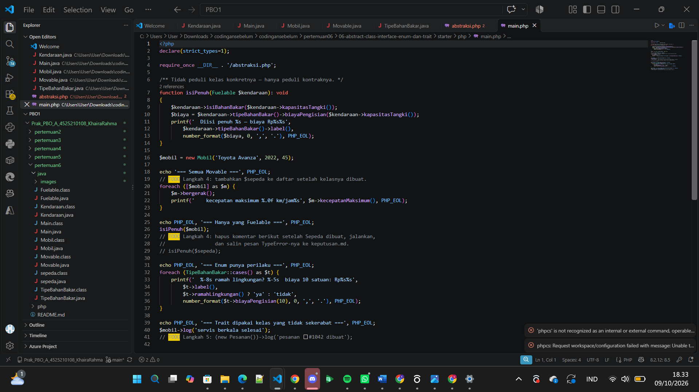

**Yang diminta:**

- **Langkah 4**: tambahkan `$sepeda` ke daftar setelah kelasnya dibuat.
- **Langkah 4**: hapus komentar pada `isiPenuh($sepeda);`, jalankan, lalu salin pesan **`TypeError`**-nya ke `keputusan.md`.
- **Langkah 5**: `(new Pesanan())->log('pesanan #1042 dibuat');`.

**Kondisi kode awal:** `isiPenuh(Fuelable $kendaraan): void` (tipe parameter **`Fuelable`**, bukan `Mobil`), `$mobil = new Mobil('Toyota Avanza', 2022, 45)`, perulangan `foreach ([$mobil] as $m)`, bagian "Hanya yang Fuelable", perulangan `TipeBahanBakar::cases()`, dan bagian trait yang baru memanggil `$mobil->log('servis berkala selesai')`.

### Setelah

**Penjelasan kode:**

1. **`$sepeda = new Sepeda('Polygon', 2023);`** dibuat dan dimasukkan ke perulangan `Movable`. Untuk keduanya dipanggil `bergerak()` dan dicetak `kecepatanMaksimum()`.
2. **Memeriksa `Fuelable` dulu.** Karena `Sepeda` bukan `Fuelable`, perulangan memakai `if ($k instanceof Fuelable) { isiPenuh($k); } else { echo "... tidak butuh bahan bakar"; }`. Dengan begitu `isiPenuh()` tidak pernah menerima `Sepeda`, sehingga tidak terjadi `TypeError`.
3. **`Pesanan` dibuat** lewat `new Pesanan('#1042', 150000.0)` dan langsung memanggil `->log('pesanan #1042 dibuat')`.
4. **Enum.** `TipeBahanBakar::cases()` mengembalikan semua `case`, dicetak dengan `number_format` agar ribuan tampil sebagai titik.

### Hasil Output

**Penjelasan dan kesimpulan:**

1. **Abstract class** (`Kendaraan`) menampung yang benar-benar sama: merek, tahun, `umur()`, dan `toString()`. Menjawab "apa benda ini".
2. **Interface** (`Movable`, `Fuelable`) menjawab "apa yang bisa dilakukan". `isiPenuh()` menerima tipe `Fuelable`, bukan `Mobil`, jadi kelas baru yang implement `Fuelable` langsung bisa dipakai tanpa mengubah `isiPenuh()`. Satu class hanya boleh punya satu induk, tetapi boleh implement banyak interface.
3. **Enum** (`TipeBahanBakar`) membatasi nilai pada tiga pilihan dan boleh punya perilaku (`biayaPengisian()`, `ramahLingkungan()`), sesuatu yang tidak bisa dilakukan konstanta `int` biasa. Di PHP, enum bertipe `string` (*backed enum*) dengan `case`.
4. **Trait** (hanya PHP) membuat `Mobil`, `Sepeda`, dan `Pesanan` berbagi `log()` meski `Pesanan` bukan kerabat `Kendaraan`. `static::class` membuat tiap baris log menyebut kelas pemakainya.
5. **Java vs PHP.** Java punya *default method* di interface (`ringkasanGerak()`), sedangkan PHP tidak, dan memakai trait sebagai padanan untuk berbagi kode.
